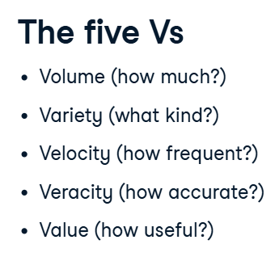
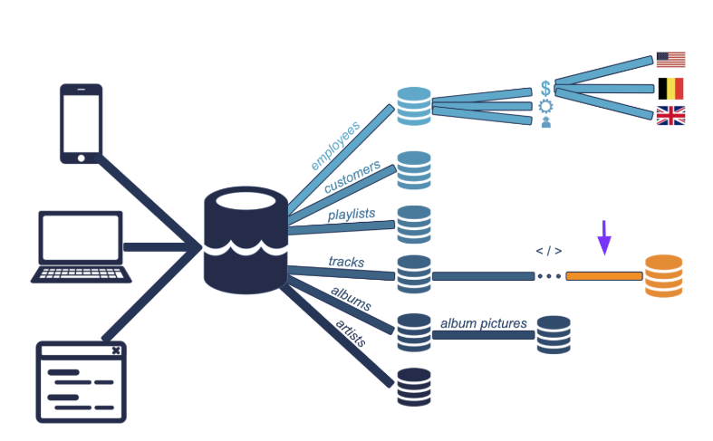
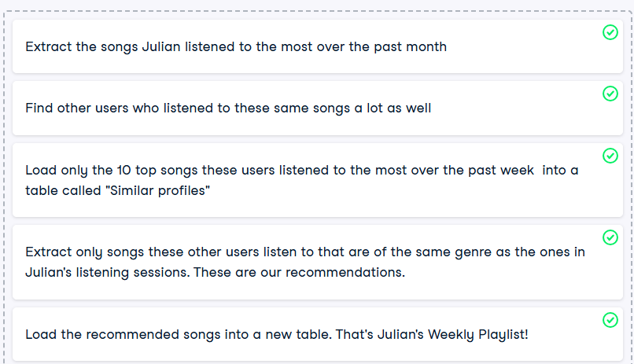
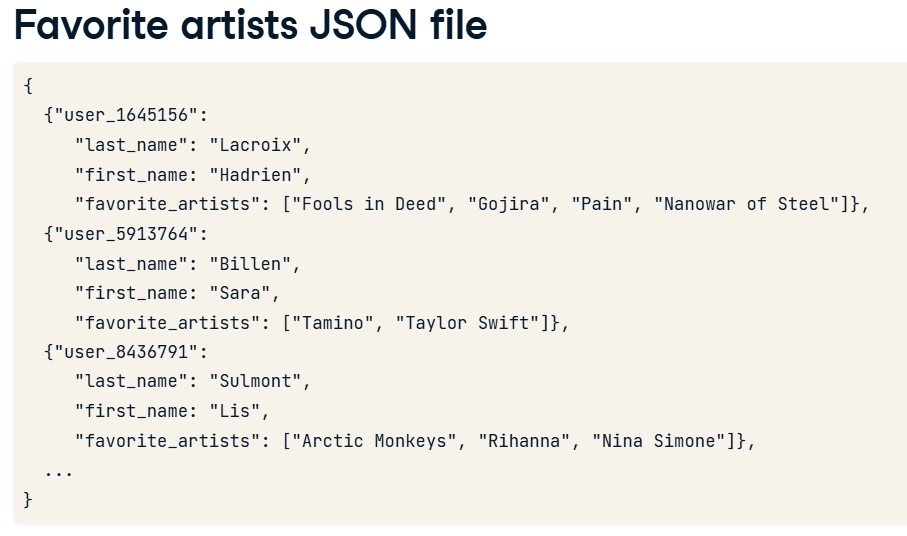
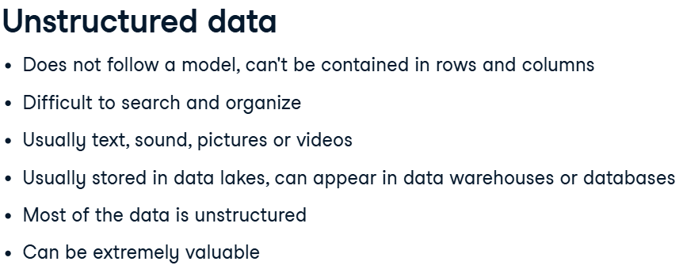
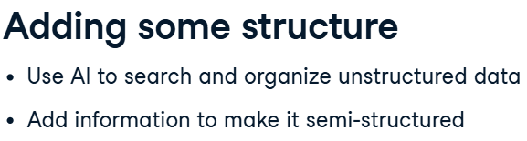
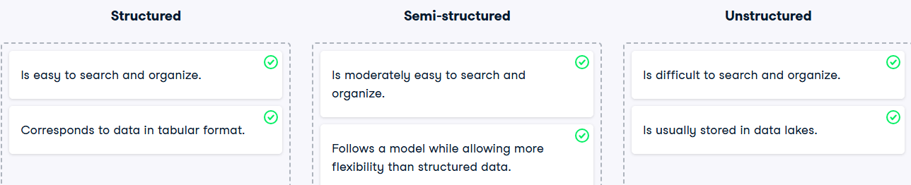
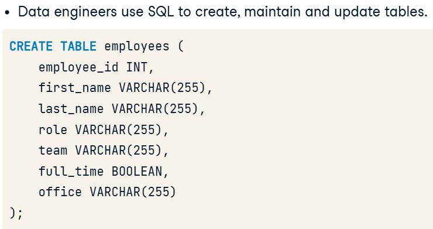
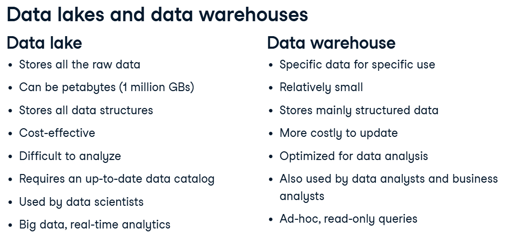
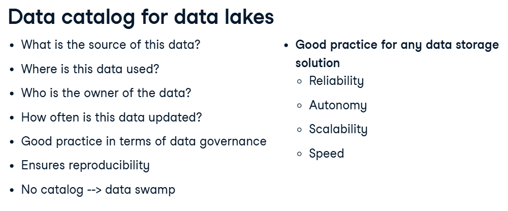

### Table of contents

- [Understanding Data Engineering](#understanding-data-engineering)
  - [What is data engineering](#what-is-data-engineering)
  - [Storing data](#storing-data)
  - [Moving and processing data](#moving-and-processing-data)
- [SQL](#sql)
   - [Introduction to SQL](#introdiction-tosql)
   - Intermediate SQL
   - Joining Data in SQL
   - Project: Analyzing Students' Mental Health
- [Database](#database)
   - Introduction to Relational Database in SQL
   - Database Design
- [Data Warehousing](#data-warehousing)
   - Data Warehousing Concepts
   - Introduction to Snowflakes
- [Underdtanding Data Visualization](#underdtanding-data-visualization)
- [Project: Exploring London's Travel Network](#project-exploring-londons-travel-network)
- Tutorial: How to Install PostgreSQL

# Understanding Data Engineering
## What is data engineering
### About big data
- big data is mainly composed of sensors and devices data, social media data, enterprise data and VoIP data.

- Five Vs of Big Data
Big data is commonly characterized by five Vs: volume (the quantity of data points), variety (type and nature of the data: text, image, video, audio), velocity (how fast the data is generated and processed), veracity (how trustworthy the sources are), and value (how actionable the data is). Data engineers need to take all of this into consideration.

### Understanding Data pipelines
Companies ingest data from many different sources, which needs to be processed and stored in various ways. To handle that, we need data pipelines that efficiently automate the flow from one station to the next, so that data scientists can use up-to-date, accurate, relevant data. This isn't a simple task and that's why data engineers are so important.
#### Example: 

 At Spotflix, we have sources from which we extract data. For example, the users' actions and listening history on the mobile Spotflix app, and the desktop Spotflix app, and the Spotflix website itself. We also have websites Spotflix uses internally, like their HR management system for payroll and benefits. The data is ingested into Spotflix's system, moving from their respective sources to our __data lake__. These are our __first three pipelines__.

 We then organize the data, moving it into __databases__. It could be artist data(artist database), like name, number of followers, and associated acts. albums data(albums database), like label, producer, year of release. tracks data(tracks database), like name, length, featured artists, and number of listens. playlists data, like name, song it contains,and date of creation. customers data, like username, account opening date, subscription tier. or employees data, like name, salary, reporting manager, updated by human resources. six new pipelines.
 
Some albums data can be extracted and stored directly. For example, album cover pictures all have the same format, so we can store them directly without having to crop them. One more pipeline!
   
Employees could be split in different __tables__ by department, for example sales table, engineering table, support, etc. For now, three more pipelines!

  These tables could be further split by office, for example the US, and the UK.   If data scientists had to analyze employee data(to investigate employee turnover for example), this is the data they would use. __Three more pipelines__!

- __Checking for corrupted tracks__: Tracks would need to be processed, first to check if the track is readable, then to check if the corresponding artist is in the database, to make sure the file is in the correct size and format, etc. That's one more pipeline.   The data can then be stored in a new, clean tracks database. This is one of the databases data scientists could use to build a recommendation engine by analyzing songs for similarity, for example. And that's our last pipeline!
  
 Data pipelines ensure the data flows efficiently through the organization. They automate extracting, transforming, combining, validating, and loading data, to reduce human intervention and errors, and decrease the time it takes for data to flow through the organization.   
 
 The main objective, when setting up data pipelines, is to improve the efficiency with which data flows, from its ingestion to the final users.  Data pipelines ensure an efficient flow of the data through the organization.

#### ETL
ETL:  first E for extracting the data, then T for transforming the data, and finally, L for loading this transformed data to a new database.   The key here is that data is processed before it's stored.

Example: Our data engineer, Vivian, is working on building new pipelines to generate a new product: the Weekly Playlist. It's a playlist that is created by our system every day to recommend new songs that users might like based on their tastes. Here are the steps correctly to help her build the pipeline generating a Weekly Playlist for each user. Let's start with one user, and build a pipeline to generate a Weekly Playlist for Julian, our data scientist.

## Storing data
### Intro to Data Structure
- Structured data is easy to search and organize. Data is entered following a rigid structure, like a spreadsheet where there are set columns.  You can see it follows a model: each row expects an employee and each column a specific information about that employee (team, role). Each column needs to be of a certain type. 
- Semi-structured data resembles structured data, but allows more freedom. It's therefore relatively easy to organize, and pretty structured, but allows more flexibility. It also has different types and can be grouped to form relations, although this is not as straightforwards as with structured data - you have to pay for that flexibility at some point.. Semi-structured data is stored in NoSQL databases (as opposed to SQL) and usually leverages the JSON, XML or YAML file formats.

- Unstructured data is data that does not follow a model and can't be contained in a rows and columns format. This makes it difficult to search and organize. It's usually text, sound, pictures or videos. It's usually stored in data lakes, although it can also appear in data warehouses or databases. 

Most of the data around us is unstructured. Unstructured data can be extremely valuable, but because it's hard to search and organize, this value could not be extracted until recently, with the advent of machine learning and artificial intelligence.
- Example:
At Spotflix, unstructured data consists in lyrics, songs, albums pictures and artists profile pictures, and music videos.        we could use machine learning algorithms to parse song spectrums, analyze beats per minute, chord progressions, genres to help categorize songs. Or, we could have artists give additional information when they upload their songs. Having them add the genre, and some tags, would make it semi-structured data, and would make searching and organizing easier.

### Intro to SQL Database
- SQL stands for Structured Query Language. SQL is to databases what English is to pop music. It's the preferred language to query RDBMS or Relational Database Management System - basically systems that gather several tables like the Employees table, where all tables are related to each other. 
- data engineers use SQL to create and maintain databases, while data scientists use SQL to query databases.

 integers - which mean this column will only accept whole numbers, without any decimal.  the second column, first_name, and specify it should be text (VARCHAR stands for "variable characters"). 255 means that the value entered can't be more than Two-hundred fifty-five characters long. 
databases are made of many tables. The database schema governs how tables are related.
### Intro to Data Warehouse and Data Lakes

Because no model is enforced in data lakes and any structure can be stored, it is necessary to keep a data catalog up to date. Data lakes are used by data scientists for real-time analytics on big data, while data warehouses are used by analysts for ad-hoc, read-only queries like aggregation and summarization.

A data catalog is a source of truth that compensates for the lack of structure in a data lake. Among other things, it keeps track of where the data comes from, how it is used, who is responsible for maintaining it, and how often it gets updated. It's good practice in terms of data governance (managing the availability, usability, integrity and security of the data), and guarantees the reproducibility of the processes in case anything unexpected happens. Or if someone wants to reproduce an analysis from the very beginning, starting with the ingestion of the data. Because of the very flexible way data lakes store data, a data catalog is necessary to prevent the data lake becoming a data swamp. It's good practice to have a data catalog referencing any data that moves through your organization, so that we don't have to rely on tribal knowledge, which makes us autonomous, and makes working with the data more scalable. We can go from finding data to preparing it without having to rely on a human source of information every time we have a question.

## Moving and processing data

# SQL

## Introduction to SQL

## Intermediate SQL
## Joining Data in SQL
## Project: Analyzing Students' Mental Health

# Database
## Introduction to Relational Database in SQL
## Database Design
# Data Warehousing

## Data Warehousing Concepts
# Underdtanding Data Visualization
# Project: Exploring London's Travel Network
# Tutorial: How to Install PostgreSQL
