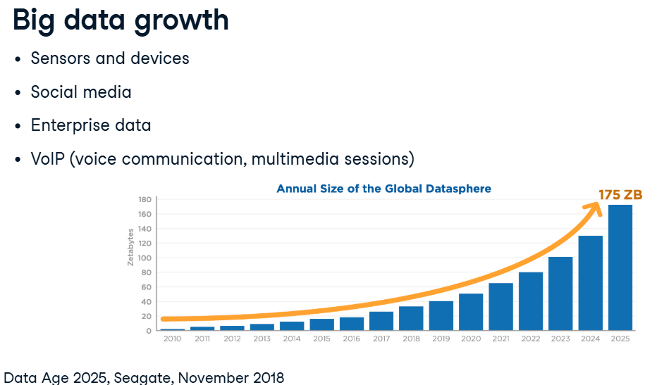

### Table of contents

- [Introduction to](#introduction-to)
 - [Archi](#archi)

# Introduction to

big data is mainly composed of sensors and devices data, social media data, enterprise data and VoIP data.

## Archi
