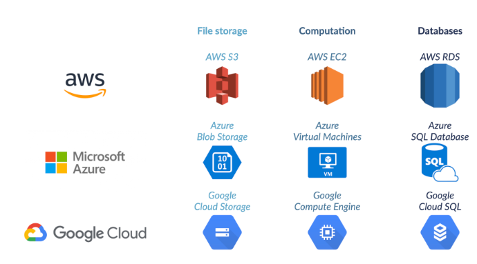
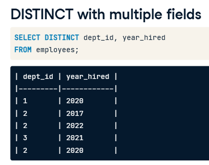

[_Next StudyNotes_](AssociateDE_StudyNotes2.md)

### Table of contents

- [Understanding Data Engineering](#understanding-data-engineering)
  - [What is data engineering](#what-is-data-engineering)
  - [Storing data](#storing-data)
  - [Moving and processing data](#moving-and-processing-data)
- [SQL](#sql)
   - [Introduction to SQL](#introdiction-tosql)
   - Intermediate SQL
   - Joining Data in SQL
   - MiniProject: Analyzing Students' Mental Health
- [Database](AssociateDE_StudyNotes2.md)
   - Introduction to Relational Database in SQL
   - Database Design
- [Data Warehousing]
   - Data Warehousing Concepts
   - Introduction to Snowflakes
- [Underdtanding Data Visualization]
- [Project: Exploring London's Travel Network]
- Tutorial: How to Install PostgreSQL


# Understanding Data Engineering
## What is data engineering
### About big data
- big data is mainly composed of sensors and devices data, social media data, enterprise data and VoIP data.

- __Five Vs of Big Data
Big data is commonly characterized by five Vs: volume (the quantity of data points), variety (type and nature of the data: text, image, video, audio), velocity (how fast the data is generated and processed), veracity (how trustworthy the sources are), and value (how actionable the data is). Data engineers need to take all of this into consideration.__

### Understanding Data pipelines
Companies ingest data from many different sources, which needs to be processed and stored in various ways. To handle that, we need __data pipelines__ that efficiently automate the flow from one station to the next, so that data scientists can use up-to-date, accurate, relevant data. This isn't a simple task and that's why data engineers are so important.
#### Example: 

 - At Spotflix, we have sources from which we extract data. For example, the users' actions and listening history on the mobile Spotflix app, and the desktop Spotflix app, and the Spotflix website itself. We also have websites Spotflix uses internally, like their HR management system for payroll and benefits. The data is ingested into Spotflix's system, moving from their respective sources to our __data lake__. These are our __first three pipelines__.

 - We then organize the data, moving it into __databases__. It could be artist data(artist database), like name, number of followers, and associated acts. albums data(albums database), like label, producer, year of release. tracks data(tracks database), like name, length, featured artists, and number of listens. playlists data, like name, song it contains,and date of creation. customers data, like username, account opening date, subscription tier. or employees data, like name, salary, reporting manager, updated by human resources. __six new pipelines__.
 
  - Some albums data can be extracted and stored directly. For example, album cover pictures all have the same format, so we can store them directly without having to crop them. __One more pipeline__!
   
  - Employees could be split in different __tables__ by department, for example sales table, engineering table, support, etc. For now, __three more pipelines__!

  - These tables could be further split by office, for example the US, and the UK.   If __data scientists had to analyze employee data__(to investigate employee turnover for example), this is the data they would use. __Three more pipelines__!

  - __Checking for corrupted tracks__: Tracks would need to be processed, first to check if the track is readable, then to check if the corresponding artist is in the database, to make sure the file is in the correct size and format, etc. That's one more pipeline.   The data can then be stored in a new, clean tracks database. This is one of the databases data scientists could use to build a __recommendation engine__ by analyzing songs for similarity, for example. And that's our last pipeline!
  
 __Data pipelines ensure the data flows efficiently through the organization. They automate extracting, transforming, combining, validating, and loading data, to reduce human intervention and errors, and decrease the time it takes for data to flow through the organization.__    The main objective, when setting up data pipelines, is to improve the efficiency with which data flows, from its ingestion to the final users.  Data pipelines ensure an efficient flow of the data through the organization.

#### ETL
ETL:  first E for extracting the data, then T for transforming the data, and finally, L for loading this transformed data to a new database.   The key here is that data is processed before it's stored.

- Example: Our data engineer, Vivian, is working on __building new pipelines to generate a new product: the Weekly Playlist__. It's a playlist that is created by our system every day to recommend new songs that users might like based on their tastes. Here are the steps correctly to help her build the pipeline generating a Weekly Playlist for each user. Let's start with one user, and build a pipeline to generate a Weekly Playlist for Julian, our data scientist.


## Storing data
### Intro to Data Structure
- Structured data is easy to search and organize. Data is entered following a rigid structure, like a spreadsheet where there are set columns.  You can see it follows a model: each row expects an employee and each column a specific information about that employee (team, role). Each column needs to be of a certain type. 
- Semi-structured data resembles structured data, but allows more freedom. It's therefore relatively easy to organize, and pretty structured, but allows more flexibility. It also has different types and can be grouped to form relations, although this is not as straightforwards as with structured data - you have to pay for that flexibility at some point.. Semi-structured data is stored in NoSQL databases (as opposed to SQL) and usually leverages the JSON, XML or YAML file formats.

- Unstructured data is data that does not follow a model and can't be contained in a rows and columns format. This makes it difficult to search and organize. It's usually text, sound, pictures or videos. It's usually stored in data lakes, although it can also appear in data warehouses or databases. 

Most of the data around us is unstructured. Unstructured data can be extremely valuable, but because it's hard to search and organize, this value could not be extracted until recently, with the advent of machine learning and artificial intelligence.
- Example:
  _At Spotflix, unstructured data consists of lyrics, songs, albums pictures and artists profile pictures, and music videos.        we could use machine learning algorithms to parse song spectrums, analyze beats per minute, chord progressions, genres to help categorize songs. Or, we could have artists give additional information when they upload their songs. Having them add the genre, and some tags, would make it semi-structured data, and would make searching and organizing easier._


### Intro to SQL Database
- SQL stands for Structured Query Language. SQL is to databases what English is to pop music. It's the preferred language to query RDBMS or Relational Database Management System - basically systems that gather several tables like the Employees table, where all tables are related to each other. 
- data engineers use SQL to create and maintain databases, while data scientists use SQL to query databases.

 integers - which mean this column will only accept whole numbers, without any decimal.  the second column, first_name, and specify it should be text (VARCHAR stands for "variable characters"). 255 means that the value entered can't be more than Two-hundred fifty-five characters long. numeric:numbers with decimal.
databases are made of many tables. The database schema governs how tables are related.
### Intro to Data Warehouse and Data Lakes

the data lake is where all the collected raw data gets stored, just as it was uploaded from the different sources. It's unprocessed and messy. While the data lake stores all the data, the data warehouse stores specific data for a specific use.    a data lake can take petabytes of data, but warehouses are usually pretty small - small on the scale of big data

 A data lake can store any kind of data, which means that it __does not enforce any model__ on the way to store the data. This makes it cost-effective. Data warehouses __enforce a structured format, which makes them more costly to manipulate__. 

However, this lack of structure in data lake also means it's very difficult to analyze. Some big data analytics using deep learning can be implemented to discover hidden patterns and trends, but that's about it, and should probably be last resort. The data warehouse, on the other hand, is optimized for analytics to drive business decisions. 

Because no model is enforced in data lakes and any structure can be stored, it is necessary to keep __a data catalog__ up to date.      Data lakes are used by data scientists for real-time analytics on big data, while data warehouses are used by analysts for ad-hoc, read-only queries like aggregation and summarization.

A __data catalog__ is a source of truth that compensates for the lack of structure in a data lake. Among other things, it keeps track of where the data comes from, how it is used, who is responsible for maintaining it, and how often it gets updated. It's good practice in terms of __data governance__ (managing the availability, usability, integrity and security of the data), and guarantees the reproducibility of the processes in case anything unexpected happens. Or if someone wants to reproduce an analysis from the very beginning, starting with the ingestion of the data. Because of the very flexible way data lakes store data, a data catalog is necessary to prevent the data lake become a data swamp. 

It's good practice to have a data catalog referencing any data that moves through your organization, so that we don't have to rely on _tribal knowledge(information that is known within a group of people but not outside of it. is often undocumented, informal, and passed down through word of mouth.)_, which makes us _autonomous(independent, self-governing, or having the power to make your own decisions.自主的）_, and makes working with the data more scalable. We can go from finding data to preparing it without having to rely on a human source of information every time we have a question.

NOTEs: __Google Cloud Storage (data lake).  Google BigQuery (data warehouse).  Generally, data warehouse is a kind of database.__

__Data Lake__: 
- Purpose: Stores raw, unprocessed data from various sources, often for exploratory or advanced analytics.
- Data Format: Stores data in its original format (structured, semi-structured, or unstructured).
- Tools: __Google Cloud Storage, Amazon S3, or Azure Data Lake.__
  
__Data Warehouse__:
- Purpose: Stores structured and cleaned data optimized for querying and reporting.
- Data Format: Stores structured and pre-processed data.
- Performance: Optimized for complex SQL queries and business intelligence (BI) tools.
- Tools: __Google BigQuery, Snowflake, Amazon Redshift or Microsoft Azure Synapse.__


## Moving and processing data
### Processing data
#### what is Processing data?
data processing consists in converting raw data into meaningful information.
- example: When we move data to the data lake, when we split it into different tables, or when we remove corrupted tracks, we are processing data.
#### why do we need to process data?

- __remove useless data__: there may be some data that we don't need at all. When rolling out a new feature, we may be watching a lot of indicators to ensure it's working as expected. But once we're sure it's stable and well integrated, we don't need this data anymore.
- __compress data__: Storing and processing data is not free, so we want to optimize our memory, process and network costs.
    - e.g., Uncompressed data can be ten times larger than compressed one: imagine if we had to process that! Our whole business model would collapse. Some data may come in a type, but would be easier to use in another. 
    - _For example, there is a tradeoff between file size and sound quality of the music tracks. At Spotflix, artists may upload data in wav or flac format, which are high quality master files. Letting users __stream__ these big files would incur big network costs. The data is processed by converting the master files to the .ogg format, a lighter format with slightly lower sound quality. It's these files that we will stream to our users._
- __move and organize data for easier use by analysts__: We want to move and organize data so it is easier for analysts to find what they need. _For Example_:
    - _music files also contain metadata (name of the artist and the genre). The data is again processed to extract the metadata and store it in a database, for easy access by data analysts and data scientists._
    - _You may want your data to fit a certain schema or structure. for example, We gather employee data and fit it to the specific table schema you saw with the employee table, separating name and last name, using logic instead of text to distinguish between part-time and full-time employees, etc._
- __automate all the data preparation__: Data processing also increases productivity. _At Spotflix, we automate all the data preparation steps we can, so that when it arrives to data scientists, they can analyze it almost immediately._
  
#### How data engineers process data?

In terms of data processing, data engineers have different responsibilities. 
- __They perform data manipulation, cleaning, and tidying tasks that can be automated, and that will always need to be done, regardless of the analysis anyone wants to do with them.__ _For example, rejecting corrupt song files, or deciding what happens with missing metadata. What should we do when the genre is missing? Do we reject the file, do we leave the genre blank, or do we provide one by default?_
- They also __ensure that the data is stored in a sanely structured database, and create views on top of the database tables for easy access by analysts.__ Views are the output of a stored query on the data. _For example, artist data and album data should be stored in separate tables in the database, but people will often want to work on these things together. __That means data engineers need to create a view in the database combining both tables.___
- Data engineers also __optimize the performance of databases__, _for example by indexing the data so it's easier to retrieve._

#### Tools


### Scheduling data

example: _If an employee is moving from the United States to Belgium, and therefore changing offices, someone can request an immediate update. We can update the table right away ourselves manually. Ideally, we'd like our pipeline to be automated as much as possible._ 

__Automation is when you set some tasks to execute at a specific time or condition.__
- __Automatically run at a specific time__: update the employee database every morning at 6 AM. 
- __Automatically run if a specific condition is met__: we could set some tasks to execute if a specific condition is met. This is called __sensor scheduling__. But it requires having sensor always listening to see if somethings been added. This requires more resources and may not be worth it in this case.
- Manual and automated systems can also also work together: if a user manually upgrades their subscription tier on the app, automated tasks need to propagate this information to other parts of the system, to unlock new features and update billing information.

#### How is the data ingested?
Batches (records are grouped and processed at intervals) or streams (records are sent individually right away)
- Data can be ingested in __batches__, which means it's sent by groups at specific intervals. Batch processing is often cheaper because you can schedule it when resources aren't being used elsewhere, typically overnight.
    - _For example, songs uploaded by artists may be batched and sent together to the databases every ten minutes, updates to the employees table can be batched every morning at 6:00 AM, and the revenue table used by the finance department can be updated overnight as well._
- The data can also be __streamed__, which means individual data records are sent through the pipeline as soon as they are updated.
    - _For example, if a user signs up, they want to be able to use the service right away, so we need to write their profile to the database immediately. Nowadays, it's inconceivable for a user to wait twenty-four hours to be able to use a service they just signed up for._
    - _Another example of batch vs. stream processing would be offline vs online listening. If a user listens online, Spotflix can stream parts of the song one after the other. If the user wants to save the song to listen offline, we need to batch all parts of the song together so they can save it._
- There's a third option called __real-time__, used for example in fraud detection, but for the sake of simplification and because __streaming__ is almost always real-time, we will consider them to be the same in this course._

Tools for scheduling: Apache Airflow, or Luigi.


### Intro to parallel computing/ parallel processing
Parallel computing forms the basis of almost all modern data processing tools. It is important mainly for memory concerns, but also for processing power. When big data processing tools perform a processing task, they split it up into several smaller subtasks. These subtasks are then distributed over several computers.

_Example: At Spotflix, we use parallel computing to convert songs from lossless format to dot ogg. It prevents us from having to load all the new songs in one computer, and to benefit from extra processing power to run the conversion scripts._

### Intro to Cloud computing

_example: Spotflix chose AWS,so we use S3 to store cover albums, EC2 to process songs, and RDS to store employees information._


# SQL

## Introduction to SQL
As we've seen, tables are organized into rows and columns; in the world of databases, rows are often referred to as records and columns as fields. 

- A field name should be singular rather than plural because it refers to the information contained in that field for a single record. This is why our table has "card_num" and "name" fields rather than "card_nums" and "names".
- A unique identifier, sometimes called a "key," is just what it sounds like: a unique value which identifies a record so that it can be distinguished from other records in the same table. This value is very often a number.
- Having more tables, each with a clearly marked subject, is generally better than having fewer tables where information about multiple subjects is combined.




### SQL flavors


## Intermediate SQL
### SQL formatting

- New lines, capitalization, and indentation are not required in SQL as they sometimes are in other programming languages, but the lack of formatting makes the code difficult to read, especially as queries become more complex. [Holywell's style guide](https://www.sqlstyle.guide)
- semicolon is unnecessary in PostgreSQL; However, including a semicolon at the end of the query is considered best practice.
- 

### Filtering
- WHERE with strings (use single-quotes around strings)
- the order of execution will now be FROM, WHERE, SELECT, LIMIT.
-  It's important to remember that BETWEEN is inclusive, meaning the results contain the beginning and end values.

We use a wildcard as a placeholder for some other values to accomplish this. 
- LIKE There are two wildcards with LIKE, the percent, and the underscore. The percent wildcard will match zero, one, or many characters in the text. The underscore wildcard will match a single character
- NOT LIKE : We can also use the NOT LIKE operator to find records that don't match the specified pattern.  e.g. WHERE name NOT LIKE 'A.%';
    - e.g. Find all name end with r : WHERE name LIKE '%r';
    - e.g. Find all name with third charater of t: WHERE name LIKE '__t%'
- IN
- IS NULL,   IS NOT NULL,  COUNT() only coount non-missing values
### Summarizing data (Aggregate functions)
- AVG(), SUM() --> Numerical fields only!
- MIN(). MAX(), COUNT()   --> various data type
    - All query results are aliased automatically 
- WHERE + aggregate functions : Bcz SELECT executed after WHERE
- ROUND():
    - ROUND() to a whole number: ROUND(AVG(field_name)), ROUND(AVG(field_name),0)
    - ROUND() to the left of the decimal point. e.g. round to the hundred thousand or five places to the left: ROUNT(AVG(filed_name), -5) -->4100000
### Arithmetic (+ - * /)
- aggregate functions, like SUM, perform their operations on the fields vertically while arithmetic adds up the records horizontally. 
### Grouping data
-  GROUP BY is commonly used with aggregate functions to provide summary statistics, particularly when only grouping a single field, certification, and selecting multiple fields, certification and title.
-  ORDER BY is always written after GROUP BY, and notice that we can refer back to the alias within the query. That is because of the order of execution.  FROM, GROUP BY, SELECT, ORDER BY, LIMIT
### Filtering grouped data -filter aggregate functions with HAVING
- order of execution: FROM, WHERE, GROUP BY, HAVING, SELECT, ORDER BY, LIMIT.
    - we cannot use the alias with HAVING, but we can with ORDER BY.
- WHERE filters individual records while HAVING filters grouped records.  

## Joining Data in SQL  
### INNER JOIN, outer joins, cross joins, self joins
The keyword: INNER JOIN, LEFT JOIN, RIGHT JOIN, CROSS JOIN, FULL JOIN

#### INNER JOIN
- When joining on two identical column names, we can employ the USING command followed by the shared column name in parentheses.


#### Outer joins
__Outer joins__ can obtain records from other tables, even if matches are not found for the field being joined on. 
  - Three types of outer joins: __LEFT JOIN, RIGHT JOIN, FULL JOIN__.
  - LEFT JOIN can also be written as LEFT OUTER JOIN. RIGHT JOIN can also be written as RIGHT OUTER JOIN. FULL JOIN an also be written as FULL OUTER JOIN.
  - FULL JOIN: A FULL JOIN combines a LEFT JOIN and a RIGHT JOIN. 
#### CROSS JOIN

- Note that the syntax is very minimal, and we do not specify ON or USING with CROSS JOIN. e.g.
  ```
  SELECT id1, id2
  FROM table1
  CROSS JOIN table2;
  ```
#### Self joins
self join is a special kind of join, where a table is joined with itself. These types of joins are called self joins.
- __Self joins are used to compare values from part of a table to other values from within the same table.__
- e.g. We want to create a new table showing all countries in the same continent as pairs.
  ```
  SELECT
    p1.country AS country1,
    p2.country AS country2,
    p1.continent
  FROM prime_ministers AS p1
  INNER JOIN prime_ministers AS p1
  ON p1.continent = p2.continent
    AND p1.country <> p2.country
  ```
    

#### chaining joins, Joining on multiple keys

#### Defining relationships
- one-to-many: This is the most common type of relationship, one where a single entity can be associated with several entities. e.g. authors table - books table, one author can writes many books.
- one-to-one: e.g. individual table - fingerprint table
- many-to-many.

### Set Theory for SQL Joins
A new way of joining data: set operators(UNION, UNION ALL, INTERSECT, EXCEPT). They require the left and right table to __have the same number of columns__ in order to compare records. Or the code wll generate an error. ALSO, the UNION columns should have the same data type!

- UNION, UNION ALL. they stack fields on top of one another.  The result will only use field names (or aliases, if used) of the first SELECT statement in the query.
  - UNION : return all records from both table without duplicates.
  - UNION ALL : return all records from both table, including duplicates.
    ```
    SELECT * FROM lefttable
    UNION
    SELECT * FROM righttable;
    ```
- INTERSECT: INTERSECT takes two tables as input, and returns only the records that exist in both tables.
    - Similar to UNION, for a record to be returned, INTERSECT requires all fields to match, since in set operations we do not specify any fields to match on. This is also why it requires the left and right table to have the same number of columns in order to compare records.
    - In INNER JOIN, similar to INTERSECT, only results where both fields match are returned. While, in this case, INNER JOIN will return duplicate values, whereas INTERSECT will only return common records once. As we know from earlier lessons, INNER JOIN will add more columns to the result set. 
- EXCEPT: it returns only records from the left table that are not present in the right table. 
### Subquerying with semi joins and anti joins
- Addictive joins: The joins we learned before are Addictive joins, they add columns to the original "left" table. Fields with different names are added to the result set with their original names.
- Semi join: returns records in the first table where a condition is met in the second table. 
    - e.g. Suppose we are interested in determining the presidents of countries that gained independence before 1800. We select the fields country, continent, and president. How do we filter this data for independence year, which is a field in the states table? We'll use a semi join!  
- Anti join: returns records in the first table where col1 does NOT find a match in col2.
 
- subquery inside WHERE, SELECT, FROM
  

