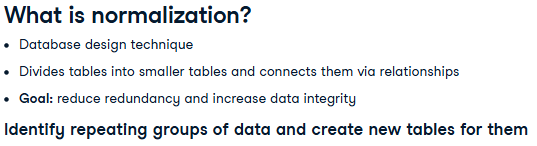
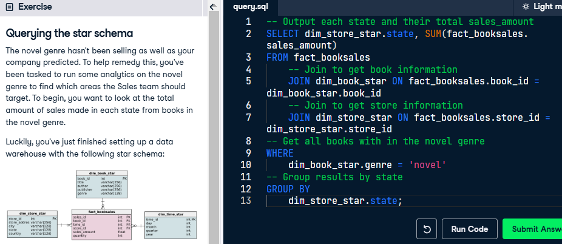
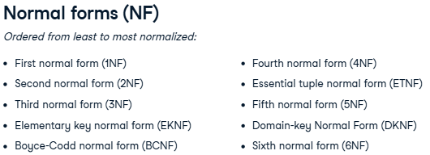

[_Previous (AssociateDE_StudyNotes1)_](AssociateDE_StudyNotes1.md) \
[_Next (AssociateDE_StudyNotes3)_](AssociateDE_StudyNotes3.md)

# Associate Data Engineering in SQL - PART II
### Table of contents - PART II

- [Database](#database)
   - [Introduction to Relational Database in SQL](#introduction-to-relational-database-in-sql)
        - [1.Your first database](#1-your-first-database)
        - [2.Better data quality with constraints](#2-better-data-quality-with-constraintsidea-of-database-and-rules) 
   - [Database Design](#database-design)
        - [Processing, Storing, and Organizing Data](#processing-storing-and-organizing-data)
        - [Database Schemas and Normalization](#database-schemas-and-normalization)
        - [Database Views](#database-views)
        - [Database Management](#database-management)
- [Data Warehousing (AssociateDE_StudyNotes3)](AssociateDE_StudyNotes3.md)
   - Data Warehousing Concepts
   - Introduction to Snowflakes
- [Understanding Data Visualization](#undersdanding-data-visualization)
     - [Project: Exploring London's Travel Network](#project-exploring-londons-travel-network)
- Tutorial: How to Install PostgreSQL


# Database

## Introduction to Relational Database in SQL
You can model different phenomena in your data, as well as the relationships between them. This gives your data structure and consistency, which results in better data quality. 
You'll learn how to create tables and specify their relationships, as well as how to enforce data integrity. You'll also discover other unique features of database systems, such as constraints.
create your very first database with a set of simple SQL commands. Next, you'll migrate data from existing flat tables into that database. You'll also learn how meta-information about a database can be queried.

### 1. Your first database
#### Why Database
why using relational databases has many advantages over using flat files like CSVs or Excel sheets?
- Story: _As a __data journalist__, I try to uncover corruption, misconduct and other newsworthy stuff with data. A couple of years ago I researched secondary employment of Swiss university professors. It turns out a lot of them have more than one side job besides their university duty, being paid by big companies like banks and insurances. So I discovered more than 1500 external employments and visualized them in an interactive graphic, shown on the left. For this story, I had to compile data from various sources with varying quality. Also, I had to account for certain specialties, for example, that a professor can work for different universities; or that a third-party company can have multiple professors working for them. In order to analyze the data, I needed to make sure its quality was good and stayed good throughout the process. That's why I stored my data in a database, whose quite complex design you can see in the right graphic. All these rectangles were turned into database tables._
       
   -  why did I use a database?
        - A database models real-life entities like professors and universities by storing them in tables.
        - Each table only contains data from a single entity type. __This reduces redundancy by storing entities only once__ – for example, there only needs to be one row of data containing the details of a certain company.
        - Lastly, a database can be used to model relationships between entities. You can define exactly how entities relate to each other. For instance, a professor can work at multiple universities and companies, while a company can employ more than one professor. 
            
- information_schema
     - information_schema database is available in database management systems (PostgreSQL, MySQL or SQL Server)by default.
     - information_schema is a meta-database that holds information about your current database. information_schema has multiple tables you can query with the known SELECT * FROM syntax:
          - tables: information about all tables in your current database
          - columns: information about all columns in all of the tables in your current database.
          - schemata: Information about all databases (schemas).
          - key_column_usage: Information about columns used in keys (primary keys, foreign keys, etc.).
          - referential_constraints: Information about foreign key constraints.
          - table_constraints: Information about table-level constraints.
   - e.g.  
   - e.g. query to get information such as the *table_name*, *table_schema*(the database name: ___'public'-> user-defined tables and databases___; The other types hold system information, e.g. 'information_schema' is the system database that holds metadata), *table_type* (whether it’s a BASE TABLE, VIEW, etc.), and more.
     ```
     SELECT * FROM information_schema.tables;
     ```
  - e.g. list all the tables information from the information_schema database
    ```
    SELECT table_name FROM information_schema.tables
    WHERE table_schema = 'information_schema';
    ```
    'table_schema' column specifies the database name, and 'information_schema' is the system database that holds metadata.
  - e.g. List all columns from all tables in information_schema database
    ```
    SELECT table_name, column_name, data_type FROM information_schema.columns
    WHERE table_schema = 'information_schema';
    ```
  - lists information about all tables in all databases
    ```
    SELECT * FROM information_schema.tables;
    --OR 
    SELECT * FROM information_schema.columns;    
    ``` 
  -  have a look at the columns information of table university_professors.
    ```
    SELECT column_name, data_type  FROM information_schema.columns
    WHERE table_name = 'university_professors' AND table_schema = 'public';
    ```
#### Create your first database
##### Tables - the core of database (Database modeling)
- redundancy in the "university_professors" table: this professor,  his university, the "ETH Lausanne" is repeated in the first three records. The reason for this is that the table actually contains entities of at least three different types: professors, universities, organizations. 
- entity-relationship diagram: Squares denote so-called entity types, while circles connected to these denote attributes (or columns). 
     - In the old entity-relationship diagram, we have only modeled one so-called entity type – "university_professors". However, we discovered that this table actually holds many different entity types.
     - New: It represents three entity types, "professors", "universities", and "organizations" in their own tables, with respective attributes. This reduces redundancy, as professors, unlike now, need to be stored only once. However, one original attribute, the "function", is still missing.  
     - __??????? A better database model with four entity types: this database contains affiliations of professors with third-party organizations. The attribute "function" gives some extra information to that affiliation. For instance, somebody might act as chairman for a certain third-party organization. So the best idea at the moment is to store these affiliations in their own table – it connects professors with their respective organizations, where they have a certain function.__
       
- We dropped the "university_shortname" column in affiliations before migrating data, bcz it is not even needed here. why? 
     - A professor is uniquely identified by firstname, lastname only.
     - _?????? I queried the "university_professors" table and saw that there are 551 unique combinations of first names, last names, and associated universities. I then queried the table again and only looked for unique combinations of first and last names. Turns out, this is also 551 records. This means that the columns "firstname" and "lastname" uniquely identify a professor._
     - _?????? So the "university_shortname" column is not needed in order to reference a professor in the affiliations table. You can remove it, and this will reduce the redundancy in your database again. In other words: The columns "firstname", "lastname", "function", and "organization" are enough to store the affiliation a professor has with a certain organization._

##### how to create such databases from scratch? (build and maintain databases)?
- Create new tables: create four empty tables for professors, universities, organizations, and affiliations.
  ```
  CREATE TABLE table_name(
  column_a data_type,
  column_b data_type
  );
  ```
     - data_type: text; numeric; char(5) : fixed-length character strings with 5 characters each;       
- adding columns to existing tables, especially if they're still empty.
  ```
  ALTER TABLE table_name
  ADD COLUMN column_name data_type;
  ```
- Rename a column
  ```
  ALTER TABLE table_name
  RENAME COLUMN old_name TO new_name;
  ```
- Delete a column, Dropping columns is straightforward when the tables are still empty.
  ```
  ALTER TABLE table_name
  DROP COLUMN column_name;
  ```
- Delete a table
  ```
  DROP TABLE table_name;
  ```
 
##### Migrate the data (update your database as the structure changes)
migrate data from 'university_professors' of old diagram to four new empty tables of our better database model, moving the respective entity types to their appropriate tables. In the end, delete the "university_professors" table.
One advantage of splitting up "university_professors" into several tables is the reduced redundancy.
- copy data from an existing table to a new one:
  ```
  INSERT INTO new_table_name
  SELECT DISTINCT colunm_name1, column_name2
  FROM old_table_name;
  ```
- insert values manually
  ```
  INSERT INTO table_name (column_a, column_b)
  VALUES ("value_a", "value_b");
  ```

### 2. Better data quality with constraints(idea of database and rules)
__the idea of a database__ is to push data into a certain structure – a pre-defined model, where you enforce data types, relationships, and other rules. Generally, these rules are called __integrity constraints__, although different names exist.
  (enforce a database constraint)
- attribute constraints: e.g., a certain attribute, represented through a database column, could have the integer data type, allowing only for integers to be stored in this column.
- key constraints: e.g. Primary keys, uniquely identify each record, or row, of a database table.
- referential integrity constraints: In short, they glue different database tables together.
  

- So constraints give you consistency, meaning that a row in a certain table has exactly the same form as the next row, and so forth.

#### 2.1 Enforce data consistency with attribute constraints (data types)
After building a simple database, it's now time to make use of the features. You'll specify data types in columns, enforce column uniqueness, and disallow NULL values in this chapter.
Three concepts that help preserve data quality in databases: __constraints, keys, and referential integrity__. (use constraints, keys and referential integrity in order to assure data quality.)

data types in PostgreSQL. 
   - basic data types for numbers, such as "bigint"
   - strings of characters, such as "character varying".
   - more high-level data types like "cidr", which can be used for IP addresses.
   - Implementing such a type on a column would disallow anything that doesn't fit the structure of an IP.


use the "CAST" function to turn "wind_speed" (text type) into an integer.

Practice:
- e.g. create a fictional database table (transactions) that holds three records(rows). The columns have the data types date, integer, and text, respectively. (According to the PostgreSQL documentation, the column _transaction_date_ with __date__ type accepts values in the form of YYYY-MM-DD, DD/MM/YY, and so forth.)
         ```
         CREATE TABLE transactions (
         transaction_date date,
         amount integer,
         fee text
         );
          -- Let's add a record to the table
         INSERT INTO transactions (transaction_date, amount, fee) 
         VALUES ('2018-09-24', 5454, '30');  
         ```

##### Working with data types (--Attribute Constraints)
- Data types
     - Enforced on columns(i.e. attributes: data types are attribute constraints and are therefore implemented for single columns of a table.)
     - Define the so-called "domain" of a column.
     - Define what operations are possible (+ - * / doesn't work on text)
     - Enforce consistent storage of values (consistent storage is enforced, so a street number will always be an actual number, and a postal code will always have no more than 6 digits, according to your conventions. This greatly helps with data quality.)
- The most common types in PostgreSQL
     -    "integer" allows only whole numbers in a certain range. If that range is not enough for your numbers, there's also "bigint" for larger numbers.
     - e.g.
       ```
       CREATE TABLE students (
       ssn integer,
       name varchar64),
       dob date,
       average_grade numeric(3, 2), --e.g. 5.54
       tuition_paid boolean
       );
       -- Alter types after table creation
       ALTER TABLE students
       ALTER COLUMN name
       TYPE varchar(128);

       ALTER TABLE students
       ALTER COLUMN average_grade
       TYPE integer
       -- Turns 5.54 into 6, not 5, before type conversion
       USING ROUND(avergae_grade);
       ```
       

##### two special attribute constraints: The not-null and unique constraints


Attribute constraints didn't actually change the structure of the mode.
#### 2.2. Uniquely identify records with key constraints (primary/foreign key)


In the entity-relationship diagram, keys are denoted by underlined attribute names. Notice that you'll add a whole new attribute to the "professors" table, and you'll modify existing columns of the "organizations" and "universities" tables.
##### Keys and superkeys
- what is key? what is superkey? what is candidate key?
     - 
          - Typically a database table has an attribute, or a combination of multiple attributes, whose values are unique across the whole table. Such attributes identify a record uniquely. Normally, a table, as a whole, only contains unique records, meaning that the combination of all attributes is a key in itself. However, __it's called a superkey if attributes from that combination can be removed, and the attributes still uniquely identify records.__
          - __If all possible attributes have been removed but the records are still uniquely identifiable by the remaining attributes, we speak of a minimal superkey, which is the actual _key_. So a key is always minimal.__
     - e.g. 
          - __the combination of all attributes is a superkey.__ (If we remove the "year" attribute from the superkey, the six records are still unique, so it's still a superkey. ) Actually, __there are a lot of possible superkeys in this example.__
          -  Remember that superkeys are minimal if no attributes can be removed without losing the uniqueness property. This is trivial for K1 to 3, as they only consist of a single attribute.
          - These four minimal superkeys are also called __candidate keys__.(why?-next video)

- Practice: Identify keys: Your database doesn't have any defined keys so far, and you don't know which columns or combinations of columns are suited as keys. There's a simple way of finding out whether __a certain column (or a combination)__ contains only unique values – and thus identifies the records in the table.
     - ```
       SELECT COUNT(DISTINCT(column_a, column_b, ...)) FROM table;
       ```

##### Primary keys
- What is Primary key?
     - 
     - time-invariant, meaning that they must hold for the current data in the table – but also for any future data that the table might hold.
- Adding/specifying primary key upon table creation
     - 
     - these two tables at the left accept exactly the same data, however, the latter has an explicit primary key specified.
     - you can designate more than one column(the combination of columns) as the primary key(see right in pic). Ideally, though, primary keys consist of as few columns as possible!
- Adding primary key constraints to existing tables.(you have to give the constraint a certain name)
     ```
     ALTER TABLE table_name
     ADD CONSTRAINT new_column_name PRIMARY KEY (column_name);
     ```
##### Surrogate keys
- What is surrogate key?
   Surrogate keys are sort of __an artificial primary key__. In other words, they are not based on a native column in your data, but on a column that just exists for the sake of having a primary key. 
- Why do we need surrogate key?
     - Primary keys should be built from a few columns as possible
     - Primary keys should never change over time.
     - If you can't find a good cadidate key as the primary key for an existing table(OR the existing attributes are not really suited as primary key), you can define an artificial primary key, ideally consisting of a unique number or string, which stays the same for each record. Other attributes might change, but the primary key always has the same value for a given record.  
- Adding a surrogate key with __serial__ data type: a special data type in PostgreSQL that allows the addition of auto-incrementing numbers to an existing table. Once you add a column with the "serial" type, all the records in your table will be numbered. Whenever you add a new record(don't provide value for surrogate key) to the table, it will automatically get a number that does not exist yet. 
     ```
     ALTER TABLE cars
     ADD COLUMN id serial PRIMARY KEY
     INSERT INTO cars
     VALUES('Volk', 'Blitz', 'black');
     ```
- Another strategy for creating a surrogate key: combine two existing columns into a new one.  
     - we first add a new column with the "varchar" data type. We then "UPDATE" that column with the concatenation of two existing columns. The "CONCAT" function glues together the values of two or more existing columns. Lastly, we turn that new column into a surrogate primary key.
       ```
       ALTER TABLE table_name
       ADD COLUMN column_c varchar(256);
       UPDATE table_name
       SET column_c = CONCAT(column_a, column_b);
       ALTER TABLE table_name
       ADD CONSTRAINT pk PRIMARY KEY(column_c);
       ```
#### 2.3. Glue together tables with foreign keys
In the final chapter, you'll leverage foreign keys to connect tables and establish relationships that will greatly benefit your data quality. And you'll run __ad hoc analyses__ on your new database.
##### Model 1:N relationships with foreign keys
- model a so-called relationship type between "professors" and "universities". 
     -  
     -  In the ER diagram, this is drawn with a rhombus. The small numbers specify the cardinality of the relationship: a professor works for at most one university, while a university can have any number of professors working for it – even zero.
- Implement relationships with foreign keys
     - __A foreign key(FK) points to the primary key(PK) of another table__ (i.e What is foreign key?    Foreign keys are designated columns that point to a primary key of another table.)
     - __Domain of FK must be equal to domain of PK.__ (One of three restrictions for foreign keys: the domain and the data type must be the same as one of the primary key)
     - __Each value of FK must exist in PK of the other table(FK constraint or "referential integrity").__ (One of three restrictions for foreign keys: only foreign key values are allowed that exist as values in the primary key of the referenced table. This is the actual foreign key constraint, also called "referential integrity".)
     - __FKs are not actual keys.__ (One of three restrictions for foreign keys: a foreign key is not necessarily an actual key, because duplicates and "NULL" values are allowed. )
- Specifying foreign keys - when creating new tables
     -  
     -  As each car is produced by a certain manufacturer, it makes sense to also add a foreign key to this table. We do that by writing the "REFERENCES" keyword, followed by the referenced table and its primary key in brackets. From now on, only cars with valid and existing manufacturers may be entered into that table. Trying to enter models with manufacturers that are not yet stored in the "manufacturers" table won't be possible, thanks to the foreign key constraint.
- Specifying foreign keys - adding foreign keys to existing tables
      ```
       ALTER Table a
       ADD CONSTRAINT a_fkey FOREIGN KEY (b_id) REFERENCES b (id);
       ```
     - Pay attention to the __naming convention__ employed here: Usually, a foreign key referencing another primary key with name id is named x_id, where x is the name of the referencing table in the singular form.

- Practice:
     - WHEN insert a foreign key value that doesn't exist in reference table, ERROR: insert or update on table "professors" violates foreign key constraint "professors_fkey" .    DETAIL:  Key (university_id)=(MIT) is not present in table "universities".
  
##### Model more complex relationships
- relationship between organizations and professors: an N:M relationship.
     -   
     -  a professor can be affiliated with more than one organization and vice versa. Also, this an N:M relationship has an own attribute, the function. Remember that each affiliation comes with a function, for instance, "chairman". The second thing you'll notice is that the affiliations entity type disappeared altogether. For clarity, I still included it in the diagram, but it's no longer needed. However, you'll still have four tables: Three for the entities "professors", "universities" and "organizations", and one for the N:M-relationship between "professors" and "organizations".

- Implement N:M-relationships
     - 
     - Two foreign keys: one pointing to the "professors.id" column, and one pointing to the "organizations.id" column.
     - additional attributes, in this case "function", need to be included.
     - Code shown in above pic of creating that relationship table from scratch. Note that "professor_id" is stored as "integer", as the primary key it refers to has the type "serial", which is also an integer. On the other hand, "organization_id" has "varchar(256)" as type, conforming to the primary key in the "organizations" table.
     - One last thing: Notice that no primary key is defined here because a professor can theoretically have multiple functions in one organization. One could define the combination of all three attributes as the primary key in order to have some form of unique constraint in that table, but that would be a bit over the top.

- Migrate data: Since you already have a pre-populated affiliations table, things are not going to be so straightforward. You'll need to link and migrate the data to a new table to implement this relationship.
     - You're going to transform the affiliations table in-place, i.e., without creating a temporary table to cache your intermediate results.
       ```
       -- Add a professor_id column
       ALTER TABLE affiliations
       ADD COLUMN professor_id integer REFERENCES professors (id);

       -- Rename the organization column to organization_id
       ALTER TABLE affiliations
       RENAME COLUMN organization TO organization_id;
       
       -- Add a foreign key on organization_id so that it references the id column in organizations
       ALTER TABLE affiliations
       ADD CONSTRAINT affiliations_organization_fkey FOREIGN KEY (organization_id) REFERENCES organizations (id);
       ```
     - So far, professor_id in table affiliations is null. __Update the professor_id column with the corresponding value of the id column in professors.__ "Corresponding" means rows in professors where the firstname and lastname are identical to the ones in affiliations.
       ```
       -- Set professor_id to professors.id where firstname, lastname correspond to rows in professors
       UPDATE affiliations
       SET professor_id = professors.id
       FROM professors
       WHERE affiliations.firstname = professors.firstname AND affiliations.lastname = professors.lastname;       
       ```
     - Drop firstname, lastname columns from the affiliations table
       ```
       -- Drop the firstname column
       ALTER TABLE affiliations
       DROP COLUMN firstname;
       -- Drop the lastname column
       ALTER TABLE affiliations
       DROP COLUMN lastname;
       ```
 
##### Referential integrity
- What is referential integrity?
     - states that __a record referencing another record in another table must always refer to an existing record.__ In other words: A record in table A cannot point to a record in table B that does not exist.
     - Referential integrity is a constraint that __always concerns two tables__,
     - and is __enforced through foreign keys__ 
     - e.g. if you define a foreign key in the table "professors" referencing the table "universities", referential integrity is held from "professors" to "universities".

- Referential integrity violations (two ways).
     - __if a record in table B that is referenced from a record in table A is deleted.__
     - __if a record in table A referencing a non-existing record from table B is inserted.__
     - Referential integrity from table A to table B will be violated. And __Foreign keys prevent violations__- they will __throw errors__ and stop you from accidentally doing these things.

- How to deal with violations?  
     - throwing an error is not the only option. If you specify a foreign key on a column, you can actually tell the database system what should happen if an entry in the referenced table is deleted.
     - __By default, the "ON DELETE NO ACTION" keyword is automatically appended to a foreign key definition__, like in the example here. This means that if you try to delete a record in table B which is referenced from table A, the system will throw an error. However, there are other options.
     - __there's the "CASCADE" option__, which will ___first allow the deletion of the record in table B, and then will automatically delete all referencing records in table A.___ So that deletion is cascaded.
     -  
     -  More options:
          -          - 
          - __The "RESTRICT" option is almost identical to the "NO ACTION" option.__ The differences are technical and beyond the scope of this course.
          - More interesting is __the "SET NULL" option__. It will set the value of the foreign key for this record to "NULL".
          - __The "SET DEFAULT" option__ only works if you have specified a default value for a column. It automatically changes the referencing column to a certain default value if the referenced record is deleted. Setting default values is also beyond the scope of this course, but this option is still good to know.
            
- Practice: Change the referential integrity behavior of a key.
     - story: So far, you implemented three foreign key constraints:
       **** SET professors.university_id = universities.id ****
       **** SET affiliations.organization_id = organizations.id ****
       **** SET affiliations.professor_id = professors.id ****
       These foreign keys currently have the behavior ON DELETE NO ACTION. Here, you're going to change that behavior for the column referencing organizations from affiliations --> If an organization is deleted, all its affiliations (by any professor) should also be deleted.
     - How to alter a key constraint: DROP the key constraint and then ADD a new one with a different ON DELETE behavior.
     ```
     -- Have a look at the existing foreign key constraints by querying table_constraints in information_schema
     SELECT constraint_name, table_name, constraint_type
     FROM information_schema.table_constraints
     WHERE constraint_type = 'FOREIGN KEY';

     -- Drop the right foreign key constraint
     ALTER TABLE affiliations
     DROP CONSTRAINT affiliations_organization_id_fkey;

     -- Add a new foreign key constraint from affiliations to organizations which cascades deletion
     ALTER TABLE affiliations
     ADD CONSTRAINT affiliations_organization_id_fkey FOREIGN KEY (organization_id) REFERENCES organizations (id) ON DELETE CASCADE;         
     ```
##### Roundup (Review And ad-hoc analysis)
- Review: Transform a table(flat files like CSVs or excel files) into the database schema-only by executing SQL queries:
     - Define column data types
     - Key constraints (add primary/foreign keys, specify relationships between tables)

- The DBMS exposes a query interface where you can run ad-hoc analyses and queries with SQL. However, you can also access this interface through other client applications. You could, for example, program a Python script that connects to the database, loads data from it, and visualizes it.  
  
- After this, you'll no longer manipulate data in your database system, but employ some analysis queries on your database.

## Database Design
A good database design is crucial for a high-performance application. \
how your data will be stored beforehand. a well-designed database ensures ease of access and retrieval of information. While choosing a design, a lot of considerations have to be accounted for. \
In this course, you'll learn how to process, store, and organize data in an efficient way. You'll see how to structure data through normalization and present your data with views. Finally, you'll learn how to manage your database and all of this will be done on a variety of datasets from book sales, car rentals, to music reviews.

### Processing, Storing, and Organizing Data
two approaches to data processing, OLTP and OLAP. the basics of data modeling.
#### OLTP and OLAP
- How should we organize and manage data?
     -  
     -  we have to consider the different schemas, management options, and objects that make up a database.  These topics all affect the way data is stored and accessed. Some enable faster query speeds. Some take up less memory than others. And notably, some cost more money than others.
     -  there is no one right answer to this motivating question. It will come down to how the data will be used.
- Approaches to processing data (OLTP vs OLAP)
     - They help define the way data is going to flow, be structured, and stored. If you figure out which fits your business case, designing your database will be much easier.
     - OLTP stands for __Online Transaction Processing__, which is oriented around transactions. application-oriented,like for bookkeeping for example. 
     - OLAP stands for __Online Analytical Processing__. which is oriented around analytics. are oriented around a certain subject that's under analysis, like last quarter's book sales. 
     - Use cases: OLTP focus on supporting day-to-day operations, while OLAP tasks are vaguer and focus on business decision making.     
- OLTP and OLAP working together
     - OLTP data is usually stored in an operational database that is pulled and cleaned to create an OLAP data warehouse. Analyses from OLAP systems are used to inform business practices and day-to-day activity, thereby influencing the OLTP databases.
#### Storing data
- Data can be stored in three different levels: Structured data(SQL, tables in a relational database), Unstructured data(photos, chat logs, MP3), Semi-structured data(NoSQL, XML, JSON). \
  The semi-structured data does not follow a larger schema, rather it has an ad-hoc self-describing structure.
- Databases: Traditional database(operational database, used for OLTP), Data warehouse(OLAP), Data lake.
     -  \
       We use the term "traditional databases" because many people consider data warehouses and lakes to be a type of database
     -  \
       Data warehouses are optimized for __read-only__ analytics. In their database design, they typically use dimensional modeling and a denormalized schema. \
       Amazon, Google, and Microsoft all offer data warehouse solutions, known as Redshift, Big Query, and Azure SQL Data Warehouse, respectively. \
       A data mart is a subset of a data warehouse dedicated to a specific topic. Data marts allow departments to have easier access to the data that matters to them.  
     - Data Lakes
        \
       why lower cost in data lakes? Data Lake storage is cheaper because it uses object storage as opposed to the traditional block or file storage. This allows massive amounts of data to be stored effectively of all types, from streaming data to operational databases. \
       Lakes are massive because they store all the data that might be used. Data lakes are often petabytes in size - that's 1,000 terabytes! Unstructured data is the most scalable, which permits this size. \
       __Lakes are schema-on-read__, meaning the schema is created as data is read. __Warehouses and traditional databases are classified as schema-on-write__ because the schema is predefined. \
       Data lakes have to be organized and cataloged well; otherwise, it becomes an aptly named "data swamp." Data lakes aren't only limited to storage. It's becoming popular to run analytics on data lakes. This is especially true for tasks like deep learning and data discovery, which needs a lot of data that doesn't need to be that "clean." \
- Two different approaches for describing data flow: ETL and ELT
     -  
     - ETL is the more traditional approach for warehousing and smaller-scale analytics. In ETL, data is transformed before loading into storage - usually to follow the storage's schema, as is the case with warehouses.
     - ELT has become common with big data projects. __In ELT, the data is stored in its native form__ in a storage solution like a data lake. __Portions of data are transformed for different purposes, from building a data warehouse to doing deep learning.__
#### Database design
- What is database design?
     -  \
       Database design determines how data is logically stored. This is crucial because it affects how the database will be queried, whether for reading data or updating data. \
       There are two important concepts to know when it comes to database design: Database models and schemas. \
       Database models are high-level specifications for database structure. The relational model, which is the most popular, is the model used to make relational databases. It defines rows as records and columns as attributes. It calls for rules such as each row having unique keys. There are other models that exist that do not enforce the same rules. \
       A schema is a database's blueprint. In other words, __the implementation of the database model. It takes the logical structure more granularly by defining the specific tables, fields, relationships, indexes, and views a database will have.__ Schemas must be respected when inserting structured data into a relational database.
- __Data modeling__
     -  \
       The first step to database design is data modeling. This is the abstract design phase, where we define a data model for the data to be stored. \
       There are three levels to a data model:
          - A conceptual data model describes what the database contains, such as its entities, relationships, and attributes.
          - A logical data model decides how these entities and relationships map to tables.
          - A physical data model looks at how data will be physically stored at the lowest level of abstraction. \
       These three levels of a data model ensure consistency and provide a plan for implementation and use.
- An example: where we want to store songs?     
     -  \
        In this case, the entities are songs, albums, and artists with various pink attributes. Their relationships are denoted by blue rhombuses. Here we have a conceptual idea of the data we want to store. \
       Here is a corresponding schema using the relational model. The fastest way to create a schema is to translate the entities into tables. But just because it's the easiest, doesn't mean it's the best. \
     - some other ways this ER diagram could be converted. \
        \
       you could opt to have one table because you don't want to have to run so many joins to get song information. \
       Or, you could add tables for genre and label. Many songs share these attributes, and having one place for them helps with data integrity. \
       The biggest difference here is how the tables are determined. There are different pros and cons to these three examples I've shown. The next chapter on normalization and denormalization will expand on this.
- __Dimensional modeling__ (beyond relational model)
     -  \
       Dimensional modeling is an adaptation of the relational model specifically for data warehouses. It's optimized for OLAP type of queries that aim to analyze rather than update. To do this, it uses the star schema. The schema of a dimensional model tends to be easy to interpret and extend. This is a big plus for analysts working on the warehouse.
     -  \
       Dimensional models are made up of two types of tables: __fact and dimension tables__.
       What the fact table holds is decided by the business use-case. It contains records of a key metric, and this metric changes often. Fact tables also hold foreign keys to dimension tables. \
       Dimension tables hold descriptions of specific attributes and these do not change as often. \
        \
       What does that mean? e.g. The turquoise table is a fact table called songs. It contains foreign keys to purple dimension tables. These dimension tables expand on the attributes of a fact table, such as the album it is in and the artist who made it. The records in fact tables often change as new songs get inserted. Albums, labels, artists, and genres will be shared by more than one song - hence records in dimension tables won't change as much. __Summing it up, to decide the fact table in a dimensional model, consider what is being analyzed and how often entities change.__

### Database Schemas and Normalization
#### Star and snowflake schema
- Star schema
     -  \
       The star schema is the simplest form of the dimensional model. Some use the terms "star schema" and "dimensional model" interchangeably.
     - e.g. you work for a company that sells books in bulk to bookstores across the US and Canada. You have a database to keep track of book sales. Let's take a look at the star schema for this database. \
        \       
       Excluding primary and foreign keys, the fact table holds the _sales amount_ and _quantity_ of books. \
       It's connected to dimension tables with details on the books sold, the time the sale took place, and the store buying the books. \
      The lines connecting these tables represent a one-to-many relationship. e.g., a store can be part of many book sales, but one sale can only belong to one store.    
- Snowflake schema
     -  \
       The snowflake schema is an extension of the star schema.
       Off the bat, we see that it has more tables. The information contained in this schema is the same as the star schema. In fact, the fact table is the same, but the way the dimension tables are structured is different. 
     - The star schema extends one dimension, while the snowflake schema extends over more than one dimension. This is because the dimension tables are normalized.       
- What is normalization? 
     -  \
       Normalization is a technique that divides tables into smaller tables and connects them via relationships. The goal is to reduce redundancy and increase data integrity.
       So how does this happen? There are several forms of normalization. But __the basic idea is to identify repeating groups of data and create new tables for them__. 
     - Let's go back to our example and to see how these tables were normalized. __i.e. how to normalize databases to different extents.__
          - book dimension:
                   \
            Here's the book dimension in the star schema. What could be repeating here? Primary keys are inherently unique.
            For book titles, although there is possible repeat here, it is not common. On the other hand, authors often publish more than one book, publishers definitely publish many books, and a lot of books share genres.
            We can create new tables for them, and it results in the following snowflake schema: these repeating groups now have their own table.
          - Store dimension:
                   \
            store dimension: City, states, and countries can definitely have more than one book stores within them.
            Notice: the way we structure these repeating groups is a bit different from the book dimension.? An author can have published in different genres and with various publishers, hence why they were different dimensions. However, a city stays in the same state and country; thus, they extend each other over three dimensions.                  
          - Time dimension:
             \
            A day is part of a month that is part of a quarter, and so on!
- Practice:
     - Adding foreign keys(???):     
     - Extending the book dimension(??): 
            
#### Normalized and denormalized databases
- example: star schema with denormalized dimension tables, snowflake schema with normalized dimension tables. The normalized database looks way more complicated. And it is in some ways.
     - For example, let's say you wanted to get the quantity of all books by Octavia E. Butler sold in Vancouver in Q4 of 2018.
       Query based on star schema: 3 jions.  \
       Query based on snaowflakes schema: 8 jions.      \
       The normalized snowflake schema has considerably more tables. This means more joins, which means slower queries. 
- Why would we want to normalize a database? 
         
     - __Normalization saves space__
       Denormalized databases enable __data redundancy__ (It has a lot of repeated information). Normalization eliminates data redundancy. 
     - __Normalization ensures better data integrity.__
         \
       First, it enforces __data consistency__. Data entry can get messy, and at times people will fill out fields differently. For example, when referring to California, someone might enter the initials "CA". __Since the states are already entered in a table, we can ensure naming conventions through referential integrity.__
       Secondly, because duplicates are reduced, __modification of any data becomes safer and simpler__. Say in the previous example, you wanted to update the spelling of a state - you wouldn't have to find each record referring to the state, instead, you could make that change in the states table by altering one record. From there, you can be confident that the new spelling will be enacted for all stores in that state.
       Lastly, since tables are smaller and organized more by object, __its easier to alter the database schema.__ You can extend a smaller table without having to alter a larger table holding all the vital data.
- Advantages and disadvantages of database normalization:
     - 
       Now normalization seems appealing, especially for database maintenance (especially for the company's __operational database__). However, normalization requires a lot more joins making queries more complicated, which can make indexing and reading of data slower.
       Deciding between normalization and denormalization comes down to __how read- or write- intensive your database is going to be__.
     - OLTP vs OLAP:
        \
       OLTP is write-intensive meaning we're updating and writing often. Normalization makes sense because we want to add data quickly and consistently.
       OLAP is read-intensive because we're running analytics on the data. This means we want to prioritize quicker read queries. 
- Practice:       \ 

#### Normal forms
- A formal definition of Normalization by Adrienne Watt. 
- __Normal forms__: 
  There are different extents to which you can normalize. These are called normal forms. Below is a list of them from least to most normalized. Each has its own set of rules, and some build on top of each other. 
- 1NF rules:
     - Each record must be unique -no duplicate rows.
     - Each cell must hold one value.
       e.g.    
- 2NF:
     -     
     - __A composite primary key is when a primary key is made up of two or more columns. If the table has a composite primary key, then each non-key column must be dependent on all the keys.__
     - e.g. student and course id as a composite primary key. We then review the other columns and their dependence on these two keys. First is the instructor, which isn't dependent on the student_id - only the course_id. Meaning an instructor solely depends on the course, not the students who take the course. The same goes for the instructor_id column. However, the percent completed is dependent on both the student and the course id. _To convert it, we can create two new tables that satisfy the conditions of 2NF_.
- 3NF: 
     -    
     - __3NF doesn't allow transitive dependencies. This means that non-primary key columns can't depend on other non-primary key columns.__
     - e.g. Course_id is the primary key so we can ignore this column. Instructor_id and Instructor definitely depend on each other. Tech does not depend on the instructor as an instructor can teach different technologies. _We can replace the table from before into these two tables to meet 3NF criteria. These tables have no transitive dependencies and they also meet 2NF as there are no composite primary keys._
- __Data anomalies__
     - Why would we want to put effort into normalizing a database even more? Why isn't 1NF enough? __A database that isn't normalized enough is prone to three types of anomaly errors: update, insertion, and deletion. The more normalized the database, the less prone it will be to these anomalies. For example, most 3NF tables can't have an update, insertion, and deletion anomalies.__
     - Update anomaly: is a data inconsistency that can arise when updating a database with redundancy. e.g. when updating a student_email, need to update all of this student's records. 
     - Insertion anomaly: is when you are unable to add a new record due to missing attributes. e.g. if a student signs up for DataCamp, but doesn't start any courses, they cannot be put into this database. The only exception is if the enrolled_in column can accept nulls. The dependency between columns in the same table unintentionally restricts what can be inserted into the table. (Table: Student_ID, Student_Email, Enrolled_in, Taught_by)
     - Deletion anomaly: happens when you delete a record and unintentionally delete other data. e.g. if you were to delete any of these students, you would lose the course information provided in the columns enrolled_in and taught_by. This could be resolved if we put that information in another table.

### Database Views
learn how to create and query views. On top of that, you'll master more advanced capabilities to manage them and end by identifying the difference between materialized and non-materialized views.
#### Database views
- What is Database views?
     - 
     - views are virtual tables that are not part of the physical schema. __A view isn't stored in physical memory; instead, the query to create the view is.__ The data in a view comes from data in tables of the same database. Once a view is created, you can query it like a regular table. The benefit of a view is that you don't need to retype common queries. It allows you to add virtual tables without altering the database's schema.  
- views syntax
     - Create a view
       ```
       CREATE VIEW view_name1 AS
       SELECT col1, col2 FROM table_name;
       ```
     - Query a view (same to quering a table)
       ```
       SELECT * FROM view_name1
       ```
       view_name1 isn't a real table with physical memory. When we run this select statement, the following query is actually being run. ``` SELECT * FROM (SELECT col1, col2 FROM table_name); ``` 
     - Viewing views (In PostgreSQL, excludes system views)
       ``` SELECT * FROM INFORMATION_SCHEMA.views
       WHERE table_schema NOT IN ('pg_catalog', 'information_schema'); ```
       DBMSs have their own built-in views. The query above excludes views from pg_catalog and information_schema which are built-in view categories.
       Because views are very useful, it's common to end up with many of them in your database. It's important to keep track of them so that database users know what is available to them. __The skill of getting familiar with viewing views within a database and interpreting their purpose is needed when writing database documentation or organizing views.__
- benefits of views
     - __Doesn't take up storage__
       a view doesn't take up any storage except for the query statement, which is minimal.
     - __A form of _access control___- Hide sensitive columns and restrict what user can see.
       Views act as a form of access control. e.g., instead of giving a user access to columns that may have sensitive information, you can restrict what they can see via a view.
     - __Masks complexity of queries__ - useful for highly normalized schemas
       views mask the complexity of queries. e.g. the total 8 joins based on snowflake schemas. You can make those common joins - such as aggregating dates or genres - into views. Views are handy for views normalized past the 2NF.

#### Managing views
- Creating more complex views- be aware of long query execution time.
     - Aggregation: SUM(), AVG(), COUNT(), MIN(), MAX(), GROUP BY, etc
     - Joins: INNER JOIN, LEFT JOIN, RIGHT JOIN, FULL JOIN
     - Conditions: WHERE, HAVING, UNIQUE, NOT NULL, AND, OR, >, <, etc
- Granting and revoking access to a view (access control) - see more details in Chapter 4
     - 
       e.g. The update privilege on an object called ratings is being granted to public. PUBLIC is a SQL term that encompasses all users. All users can now use the UPDATE command on the ratings object. In the second line, the user db_user will no longer be able to INSERT on the object films.
       __Syntax and example:__
       ```
       GRANT UPDATE ON ratings TO PUBLIC;
       REVOKE INSERT ON films FROM db_users;
       ```
- Updating a view
     - Syntax. e.g.  ```UPDATE film SET kind = 'Dramatic' WHERE kind ='Drama'; ```
     - Not all views are updateable:
          - View is made up of one table
          - Doesn't use a window or aggregate function.  \
       when you update a view, you are updating the tables behind the view. Hence, only particular views are updatable. There are criteria for a view to be considered updatable. The criteria depend on the type of SQL being used. Generally, the view needs to be made up of one table and can't rely on a window or aggregate function.
- Inserting into a view
     - Generally, __avoid modifying data through views__. It's usually a good idea to use views for read-only purposes only. __Not all views are insertable.__
     - e.g. ``` INSERT INTO film (code, title) VALUES ('T_601', 'Yojimbo'); ```
- Dropping a view
     - Syntax: DROP VIEW view_name [ CASCADE | RESTRICT ]
     - __RESTRICT__ (default): returns an error if there are objects that depend on the view
     - __CASCADE__ : drops view and any object that depends on that view.     
- Redefining a view
     - Syntax: CREATE OR REPLACE VIEW view_name AS new_query
     - If a view with view_name exists, it is replaced.
     - However, there are limitations to this.
          - The new_query must generate the same column names, column order, and column data types as the existing query.
          - The column output may be different, as long as those conditions are met.
          - New columns may be added at the end.
          - If this criteria can't be met, the solution is to drop the existing view and create a new one.
- Altering a view
     -  \ This includes changing the name, owner, and schema of a view.

#### Materialized views
- Two types of views
     - Views: also known as non-materialized views, remain virtual.
     - Materialized views: physically materialized.
- Materialized views
     -  \
       a materialized view stores the query results. These query results are stored on disk. This means the query becomes precomputed via the view.
       When you query a materialized view, it accesses the stored query results on the disk, rather than running the query like a non-materialized view and creating a virtual table. Materialized views are refreshed or rematerialized when prompted.
       By refreshed or rematerialized, I mean that the query is run and the stored query results are updated. This can be scheduled depending on how often you expect the underlying query results are changing.
       At Datacamp, some of our views are refreshed once-a-day during non-working hours, and others are refreshed every hour.
- When to use materialized views?
     - __Long running queries(queries with long execution time.__ Some queries take hours to complete if you are crunching a lot of data or have complex joins. Materialized views allow data scientists and analysts to run long queries and get results very quickly.)
     - __Underlying query results don't change often.__ (you shouldn't use materialized views on data that is being updated often, because then analyses will be run too often on out-of-date data.)
     - __Data warehouses because OLAP is not write-intensive.__  (__Materialized views are particularly useful in data warehouses__. Data warehouses are typically used for OLAP, meaning more for analysis than writing to data. This means less worry about out-of-date data. Furthermore, the same queries are often run in data warehouses, and the computational cost of them can add up.)
- Implementing materialized views(In PostgreSQL)
     - Syntax:
       """
       -- Create materialized view
       CREATE MATERIALIZED VIEW my_mv AS SELECT * FROM table_name;
       -- Refresh materialized view
       REFRESH MATERIALIZED VIEW my_mv;
       ```
       There isn't a PostgresSQl command to schedule refreshing views. However, there are several ways to do so, like using cron jobs. cron is a UNIX based job scheduler.
- Managing dependencies
     - you need to manage dependencies when you refresh materialized views when you have dependencies. Why?
     - e.g. two materialized views: X and Y. Y uses X in its query; meaning Y depends on X. Let' s say X has a more time-consuming query. If Y is refreshed before X's refresh is completed, then Y now has out-of-date data.
     - How? Create a __dependency chain__ when refreshing views.
     - Scheduling when to refresh. Refreshing them all at the same time is not the most efficient when you consider query time and dependencies.
- Tools for managing dependencies (Airflow, Luigi)
     - Use Directed Acyclic Graphs(DAGs) to keep trach of views
     - Pipeline scheduler tools
       Companies that have many materialized views, use directed acyclic graphs to track dependencies and pipeline scheduler tools, like Airflow and Luigi, to schedule and run REFRESH statements.
       DAGs (A directed acyclic graph）is a finite directed graph with no cycles. the directed arrows reflect a dependency in a certain direction where one node depends on another. The no cycles part is important because two views can't depend on each other - only one can rely on another

### Database Management
You will learn how to grant database access based on user roles, how to partition tables into smaller pieces, what to keep in mind when integrating data, and which DBMS fits your business needs best.
#### Database roles and access control
- Database roles
     - 
- Create / Alter a role
     - e.g.
       ```
       --- Empty role: Create the data_analyst role
       CREATE ROLE data_analyst;
       --- Roles with some attributes set
       --- create the role intern, specifying the password attribute and valid until date attribute.
       CREATE ROLE intern WITH PASSWORD 'Password' VALID UNTIL '2020-01-01';
       --- create an admin role with the ability to create databases
       CREATE ROLE admin CREATEDB;
       --- change an attribute for an already created role: allowing the admin role to create roles too.
       ALTER ROLE admin CREATEROLE;
       --- Create a role with the ability to create databases (CREATEDB) and to create roles (CREATEROLE).
       CREATE ROLE admins WITH CREATEDB CREATEROLE;
       --- Create a role called marta that has one attribute: the ability to login (LOGIN).
       CREATE ROLE marta LOGIN;
       ```
- GRANT and REVOKE privileges from roles
     - Syntax is the same as view. The available privileges in PostfreSQL are: SELECT, INSERT, UPDATE, DELETE, TRUNCATE, REFERENCES, TRIGGER, CREATE, CONNECT, TEMPORARY, EXECUTE, and USAGE.
- Users and groups (are both roles)
     - 
     - ???a common misunderstanding: a role can be a user role or a group role. A role may be a member of other roles, and we call the larger role a group. As this graphic shows, the concept of roles encompasses the concepts of “users” and “groups”.
       __Database roles - that is, user roles AND group roles - are conceptually completely separate from operating system users. Sometimes you will create a user role that belongs to one specific user, but that's not required.__
     - Think of the data_analyst role as a group role: you want all of your data analysts to have the same level of access. Think of the intern role as a user role. Sometimes you'll use the actual user's name. __e.g.__ Say Alex is hired as an intern to support the data analysts, so you want them to have the same level of access.     
       ```
       --- Group role
       CREATE ROLE data_analyst;
       --- User role
       CREATE ROLE alex WITH PASSWORD 'Password' VALID UNTIL '2020-01-01';
       --- add the user role alex to the group role data_analyst. Alex can do data analyst work now!
       GRANT data_analyst TO alex;
       --- use REVOKE to remove them from the group.
       REVOKE data_analyst FROM alex;
       ```
- Common PostgreSQL roles
     -  \ PostgreSQL has a set of default roles, which provide access to commonly needed privileged capabilities and information. These are beyond the scope of this course.
- Benefits and pitfalls of roles
     - Benefits
          - Roles live on after users are deleted.
          - Roles can be created before user accounts
          - Save DBAs(database administrators) time
      - Pitfalls : sometimes a role gives an individual too much access. 

#### Table partitioning
- Partitioning: split table into multiple small parts. Partitioning is part of physical data model.
- Two types of partitions: vertical partitioning, horizontal partitioning
- Vertical partitioning
     - Vertical partitioning splits up a table vertically by its columns, even when it's already fully normalized. e.g. 
       It has four columns. After vertical partitioning, you could end up with two tables: one for the first three columns, and another for the last column. We can link them through a shared key. __Let's say the fourth column, containing a long description, is retrieved very rarely. We could store the second table on a slower medium.__ Doing this would improve query time for the first table, as we need to scan less data for search queries.
- Horizontal partitioning
     - Instead of splitting tables up over the columns, you can also split up tables over the rows. For example, you could split up data according to a timestamp. \
        \
       e.g. after PostgreSQL 10. Create partitions according to the timestamp, and partition them by quarter. First, you add the PARTITION BY clause to your table creation statement. You pass it the column you want to partition by, 'timestamp' in our case. Next, you have to create the partitions. To do this, use the PARTITION OF clause to create tables for the specific partitions. You can specify rules to partition by in the same statement. For a timestamp, you could use particular ranges of values, like this. Finally, it's advised to add an index to the column you used for partitioning.
     - Pros/cons of horizontal partitioning
       
       Horizontal partitioning can help by optimizing indices, increasing the chance heavily-used parts of the index fit in memory.   You could also move rarely accessed partitions to a slower medium.    Both OLAP and OLTP can benefit from partitioning. \
       There are some downsides though, as partitioning an existing table can be a hassle: you have to create a new table and copy over the data. Additionally, we can not always set the same type of constraints on a partitioned table, for example, the PRIMARY KEY constraint.
     - Retation to sharding: When horizontal partitioning is applied to spread a table over several machines, it's called sharding. You can see how this relates to massively parallel processing databases, where each node, or machine, can do calculations on specific shards.
- Practice:
     - Create horizontal partitions in PostgreSQL. Here, you'll be using __a list partition instead of a range partition__. __For list partitions, you form partitions by checking whether the partition key is in a list of values or not.   To do this, we partition by LIST instead of RANGE. When creating the partitions, you should check if the values are IN a list of values.__ 

#### Data integration
- What is data integration?
     - what if your data is spread across different databases, formats, schemas and technologies? That's where data integration comes into play.
     - __Data Integration combines data from different sources, formats, technologies to provide users with a translated and unified view of that data.__
- Bussiness case examples:
     -  A company could want a 360-degree customer view, to see all information departments have about a customer in a unified place.
     -  one company acquiring another, and needs to combine their respective databases.
     -  Legacy systems are also a common case of data integration.
     -  An insurance company with claims in old and new systems, would need to integrate data to query all claims at once.
- There are a few things to consider when integrating data:
     - What is your final goal? Your unified data model could be used to create dashboards, like graphs of daily sales, or data products, such as a recommendation engine. The final data model needs to be fast enough for your use-case.
     - Data sources: Which formats is each data source stored in? For example, it could be PostgreSQL, MongoDB or a CSV.
     - Unified data model format: Which format should the unified data model take? For example, Redshift, a data warehouse service offered by AWS.   
     - Specific example: Say DataCamp is launching a skill assessment module. Marketing wants to know which customers to target. They need information from sales, stored in PostgreSQL, to see which customers can afford the new product. They also need information from the product department, stored in MongoDB to identify potential early adopters. 
     - Update cadence: How often do you want to update the data?  Updating daily would probably be sufficient for sales data. For a scenario like air traffic, you want real-time updates. Your data sources can have different update cadences.
     - Transformations:
          - Your sources are in different formats, you need to make sure they can be assembled together.
          - A transformation is a program that extracts content from the table and transforms it into the chosen format for the unified model.
          - These transformations can be hand-coded, but you would have to make and maintain a transformation for each data source. You can also use data integration tool(Airflow or Scriptella), which provides the needed ETL.
          - When choosing your tool, you must ensure that it's __flexible__ enough to connect to all of your data sources. __Reliable__, so that it can still be maintained in a year. And it should __scale__ well, anticipating an increase in data volume and sources.
          - Automated testing and proactive alerts: If any data gets corrupted on its way to the unified data model, the system lets you know. For example, you could aggregate sales data after each transformation and ensure that the total amount remains the same.
          - Security: if data access was originally restricted, it should remain restricted in the unified data model. e.g. anonymize the credit card numbers data during ETL so that analysts can only access the first four numbers, to identify the type of card being used.
          - Data governance: For data governance purposes, you need to consider lineage: for effective auditing, you should know where the data originated and where it is used at all times.

#### Picking a Database Management System(DBMS)
- A DBMS is a system software for creating and maintaining databases. The DBMS manages three important aspects: the __data__, the __database schema__ which defines the database’s logical structure, and the __database engine__ that allows data to be accessed, locked and modified. Essentially, __the DBMS serves as an interface between the database and end users or application programs.__  [img](images/03_83.png)
- DBMS types : SQL DBMS, NoSQL DBMS
     - SQL DBMS (Relational DataBase Management System). Query language:SQL. e.g. SQL Server, PostgreSQL, and Oracle SQL. Used for fixed structure and doesn’t need frequent modifications
     - NoSQL DBMS(Non-relational DBMSs).
       [img](images/03_84.png) \
       NoSQL is a good choice for __those companies experiencing rapid data growth with no clear schema definitions. NoSQL offers much more flexibility than a SQL DBMS and is a solid option for companies who must analyze large quantities of data or manage data structures that vary.__
       1. NoSQL DBMS- key-value store :
          A key-value database stores combinations of keys and values: Key- unique identifier, Value: anything, from simple objects, like integers or strings, to more complex objects, like JSON structures.
          Use cases: They are most frequently used for managing session information in web applications. For example, managing shopping carts for online buyers.
          example: Redis.
       3. NoSQL DBMS- document store
          similar to key-value, but values(=documents) are structured.
          documents provide some structure and encoding of the managed data. That structure can be used to do more advanced queries on the data instead of just value retrieval. 
          Use cases: content management applications such as blogs and video platforms. Each entity that the application tracks can be stored as a single document. 
          example: mongoDB          
       5. NoSQL DBMS- columnar database
          store data in columns (__columnar databases store each column in a separate file in the system’s storage.__ This allows for databases that are more scalable, and faster at scale. )
          Scalable
          Use case: big data analytics where speed is important
          example: cassandra
       7. NoSQL DBMS- graph database
           \
          Here, the data is interconnected and best represented as a graph. This method is capable of lots of complexity. Graph databases are used by most social networks and pretty much any website that recommends anything based on your behavior.


