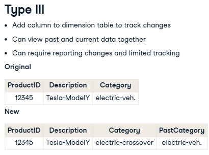

[_Previous (AssociateDE_StudyNotes1)_](AssociateDE_StudyNotes1.md)
[_Previous (AssociateDE_StudyNotes2)_](#AssociateDE_StudyNotes2.md)
[_Next (AssociateDE_StudyNotes4)_](#AssociateDE_StudyNotes4.md)

# Associate Data Engineering in SQL - PART III

### Table of contents - PART III

- [Data Warehousing](#data-warehousing)
   - [Data Warehousing Concepts](#data-warehousing-concepts)
        - [Data Warehouse Basics](#data-warehouse-basics)
        - [Warehouse Architectures and Properties](#warehouse-architectures-and-properties)
        - [Data Warehouse Data Modeling](#data-warehouse-data-modeling)
        - [Implementation and Data Prep](#implementation-and-data-prep)
   - [Introduction to Snowflakes](#introduction-to-snowflakes)
        - [Introduction to Snowflake: Architecture, Competitors, and SnowflakeSQL](#introduction-to-snowflake-architecture-competitors-and-snowflakesql)
        - [Snowflake SQL and key concepts](#snowflake-sql-and-key-concepts)
        - [Advance Snowflake SQL Concepts](#advance-snowflake-sql-concepts)
- [Understanding Data Visualization](#undersdanding-data-visualization)
     - [Project: Exploring London's Travel Network](#project-exploring-londons-travel-network)
- Tutorial: How to Install PostgreSQL

# Data Warehousing
Doesn't cover Building data pipelines, or Analyzing warehouse data
## Data Warehousing Concepts
### Data Warehouse Basics
#### What is a data warehouse?
- what is a data warehouse?
  A data warehouse is a computer system designed to store and analyze large amounts of data for an organization.  \
  The warehouse becomes __a central repository for clean and organized data for the organization.__ It does this by gathering data from different areas of an organization, integrating it, storing it, then making it available for analysis. \
  Organizations value data warehouses because they support business intelligence activity and enable analysis and decision-making, fostering data-driven innovation. Moreover, using data warehouse, the query will run on a large amount of data quicky. avoid slowing down transactional database.
- common scenarios
  Bravo, a hypothetical __publicly traded company__ that sells fancy home office furniture.  \
  Bravo might utilize its data warehouse for product forecasting. Their data warehouse aggregates their historical sales by customer and product, which is needed to forecast future demand. In addition, Bravo has specific regulations and governance it must adhere to as a publicly traded company. \
  Bravo's employees could prepare reports from the data warehouse to provide to auditors. The data warehouse could be used to confirm Bravo's adherence to the rules because the data warehouse is a store of financial transactions and customer information. \
  Finally, through analysis of their sales, Bravo noticed their sales growth is accelerating in Asia. Therefore, HR and Operations might use their production and employee data to prepare for hiring more staff to support their sales growth in Asia.

#### What's the difference between data warehouses and data lakes?
- database  
- data warehouse
     -  a single data repository for analysis
     - They are built as a central data store for the entire organization, representing many departments.
     - it is more complicated to change because of upstream and downstream impacts
     
- data marts
     - A data mart only focuses on one department, such as just Finance.
     - A data mart is a relational database that stores an organization's transactional data for analysis.
     - Data marts and data warehouses both hold structured data.
  
- data lakes
     - Data lakes, similar to data warehouses, are built as a central store of data for the entire organization for analysis.
     - Data lakes are easier to change but may contain data with an unknown purpose. (because of their flexibility in storing unstructured data. This flexibility also allows storing data whose purpose may not be known today but may be helpful for future analysis. )  
       

#### Data warehouses support organizational analysis
- Data warehouse life cycle:
  Use Case: Companies are willing to invest a large amount of money into developing a data warehouse for the potential insights they can bring. 
1. Planning - the team begins to plan how to design the data warehouse to satisfy the organization's needs.
     - __business requirements__: understand the organization's needs. Who and how will they use the data warehouse?
       \ e.g. Data Analyst works closely with others in the business, and her analysis helps with decision-making. 
       \ Data Scientist's ML models automate decision-making and improve business processes. __DA and DS are closer to the business and know their final goals and requirements best.__
     - __data modeling__: how the team transforms data from different input sources and integrates it into our data warehouse. Crucial is that the team understands and links the relevant data sets.
       \ a data engineer is skilled at creating data pipelines. Data pipelines are automatic end-to-end processes that collect, modify, and deliver data.
       \ Data engineers and transactional database admin __plan data pipelines__ from the database systems to the warehouse.
       \ Also, DA and DS use their __business knowledge__ to support this stage by helping ensure the data model accurately represents the organization.
2. Implementation - the team builds the data warehouse
     - __ETL Design & Development__: designs and builds the ETL process from the different sources into the data warehouse. 
       \  DE is responsible for creating the pipelines, but she coordinates with Database Admin to extract data from the source systems.
     - __BI Application Development__: set up BI or business intelligence tools to interact with the data warehouse and create reports needed by the organization.
       \ BI tools are often how many users interact with the data warehouse. Some standard BI tools include Tableau, Power BI, or Google's Looker. At this point, DA and DS consult on the setup of the BI application.

3. Support/Maintenance - the team trains end users and maintain the warehouse.
     - __Maintenance__: update the warehouse table designs or make other necessary changes.
       \ __DE__ makes these changes if required.
     - __Test & Deploy__:
       \ DA and DS test the system to confirm their business requirements are met.
       \ Afterward, DE will deploy and make the warehouse available to the organization.
       \ After deployment, any significant changes will follow the same steps starting back at the planning phase.
- Persona matrix  

### Warehouse Architectures and Properties
#### What are the different layers of a data warehouse?
- Four layers: source, staging, storage, presentation
1. Data source layer: all data sources(Transactional database, log files, spreadsheets, files)
2. Data staging layer: contains ETL process and storage tables
      - the ETL process stages data or temporarily places it in tables so it is ready to be used in later steps of the process.
      - ETL process within data staging layer
        - transforms data by applying business rules(like averaging), it uses staging tables here to store the results between the various transformations temporarily.
        - Able to extract valid data from unstructured data source into rows and columns(structured data)
        - The staging layer outputs data that is ready to be stored. The data can be loaded to the next layer in batches or all at once.
3. Data storage layer: data is stored in warehouse and data marts
4. Data presentation layer: 
   - the information is made available to the end user in the data presentation layer.
   - BI or Business Intelligence tools, data mining tools, analysis tools, Reporting tools(dashboard), and direct user queries connect to the warehouse and allow the end user to interact with the data. 

#### The presentation layer: tools and how users interact with data in data warehouse
- Automated reporting/dashboarding tools
     - Goal: create reports needed for decision making; create dashboards using historical data
     - Users: analysts, citizen data scientist use tools to create reports automatically or update dashboards.
     - Tools: Tableau, Power BI, Google's Looker, and SAP BW(SAP Business Warehouse)
     - These tools tend to have graphical user interfaces with little coding required to use. 
- BI/data analytics: used to explore data and find patterns. These tools may have a graphical drag-and-drop interface.
     - Goal: BI and data mining tools are often used to explore the data and uncover patterns. 
     - Users: Analysts and Data Scientists use these tools to convert data into actionable insights. 
     - Tools: Oracle Data Mining, RapidMiner, Alteryx, and KNIME are focused on data analytics and mining.
- Direct query
     - Tools: SQL Server Management Studio, Azure Data Studio, and the popular programing tools of R and Python.
#### Data warehouse architectures
\ 
- Inmon - top-down: ETL -> Data Warehouse -> Data marts
     - Essential to this architecture is that the organization __must decide on the naming, the definition, which data is valid if there are conflicts, and all other data cleaning operations on all of the data before it enters the warehouse__.
     - this architecture __stores data in the warehouse in a normalized form__.
     - The data then moves to a department-focused data marts where end users and applications can query it.
- Pros and cons of Inmon - top-down
     -  
       \ ?? conforming the input sources into a single definition that the organization agrees upon makes the data warehouse an effective source of truth.   creating new data marts for reporting or analysis is relatively straightforward.
       \ ?? As you might imagine, gaining alignment by the organization on the data definitions can take a lot of upfront work resulting in a higher startup cost for warehouse projects. WHy? -> The top-down approach has longer upfront development time before users can deliver reports __due to aligning the organization on all data definitions and cleaning rules__.
- Klmaball - bottom-top: ETL -> Data marts -> Data Warehouse
     - Various data attributes, such as name and location, connect the data marts. The data marts are then integrated into a data warehouse. 
- Pros and cons of Klmaball - bottom-top
     - 
       \ how fast it can get up and running by taking an incremental approach resulting in lower upfront costs on warehousing projects. Also, the denormalized data model makes the data easy to consume for users.
       \ However, denormalization increases the processing time within the ETL process and can create duplicate data when used across different data marts. Duplicate data can confuse and make the data warehouse less of a source of truth.
       \ An additional disadvantage is as the organization adds new departments or processes, more development will need to be done.(because of denormalized data)
       \ The bottom-up approach has a lower upfront cost but requires more upkeep than the top-down approach.
- Practice:
     - use cases:  imagine you work as a data warehousing consultant engaged with Northwestern insurance company. The company has seen much growth over time and wants to consolidate systems into a data warehouse. The company must connect the data from one department to all other departments and avoid data duplication, creating a single source of truth. Also, they would like to minimize the data storage size if possible. Finally, Northwestern's management wants a smooth implementation and would prefer the project team take the time needed to get it right the first time.
#### OLAP and OLTP systems
Another core component of Data warehouse implementations: OLAP, OLTP
- OLAP systems : Online analysis processing
     - OLAP is a tool for __performing multidimensional analysis at high speeds on large volumes of data from a data warehouse, data mart, or some other centralized data store__.
     - In data warehousing, most organizations have data __organized into different dimensions__, such as sales figures by country, state, and city. Another dimension example is time, broken into years, months, and days.
     - OLAP systems take this two-dimensional representation of data in rows and columns and __reorganize it into a multidimensional format__ that enables fast processing for analysis. This multidimensional format allows for what is commonly called "slicing and dicing" the data. Data scientists and analysts typically work with OLAP systems.
- OLAP cube
     - 
     - At the core of the OLAP system is the OLAP data cube, a multidimensional database that makes it possible to process and analyze multiple data dimensions faster than a traditional relational database.
     - The data cube can __drill down or aggregate__ the total sales by each dimension.
     - Data cubes that have more than three dimensions are called hypercubes.
     - e.g. imagine we are interested in the organization's sales by region, year, and product. If we picture a cube, the cube's different edges, or height, width, and length, will represent one of these dimensions. We will have the total sales for those dimensions where these edges intersect. The data cube can drill down or aggregate the total sales by each dimension. In this example, the dimensions are region, year, and product, and total sales is the value that is aggregated or disaggregated based on the selected dimensions.
- OLTP: Online transaction processing
     - Typical uses of OLTP systems include cash terminals and reservation bookings. In these examples, the OLTP systems __processes simple queries to the database, like inserting, updating, and deleting rows__. Queries for OLTP systems tend to affect only a few rows of data within the database.
     - OLTP systems are often critical __for the business and not used for analysis__. Organizations often use them in __transactional databases or the source systems that feed into the data warehouse__.
- Example for a credit card company
     - DE is responsible for maintaining the OLTP system that tracks each customer's purchase and updates their current balance. This system was designed to __track thousands of purchases and their updates every second__.
     - For analyzing customer purchasing patterns. team uses a data warehouse and an OLAP system that __tracks purchases by year, customer age, location, and time of day__. Analysts within the company use this data to make business decisions.
  
### Data Warehouse Data Modeling
#### Data warehouse data modeling
- What is data modeling?
     \ __Data modeling refers to how we organize data in a database into tables and how to relate those tables if we want to join them.__
- Data models
     - star & snowflake schemas = bottom-up Kimball approach (two common approaches for a warehouse)
     - denormalized data models (they denormalize organizational data into dimensions and fact tables.)
     - Schema means to plan or model. So, star and snowflake schemas are models for organizing our data.
- Fact table: take a furniture company Bravo who sells fancy home office furniture as an example
     - 
     - A fact table consists of measurements, metrics or facts about an organizational process.
       \ Each row within the table captures a measurement or metric about one process transaction. e.g., Bravo tracks sales order information in a fact table that includes measures like the quantity of a product sold (UnitSold) and the taxes collected for each of Bravo's sales orders.
     - This fact table also includes information about the customer who purchased the product, the date, and the product sold. These values are not quantities on which we can perform mathematical operations but are foreign keys that allow us to join to other tables named dimension tables that provide valuable information and detail about the sales order.
       \ e.g., we could find more information about each customer who purchased an item by joining the sales order fact table to the customer dimension table. Tracking if a customer is a strategic customer is usually not an element of the fact table but of the dimension table.
- Dimension table
     - 
     - Dimension tables contain attributes and characteristics that describe the data in the fact table. These characteristics are called dimensions. For example, Bravo's customer dimension table includes customer attributes like name, account number, email address, and mailing country address. It is a reference table. By joining this dimension table with the sales fact table, we can analyze Bravo's total sales by country. __This is valuable information because it adds more detail to the total sales metric__. By joining the fact table with other dimensional tables, such as the product and date dimensional tables, we can analyze the total sales with a larger set of questions. This is what a star schema is.
- Star Schema (see more details in last chapter)
     - A central fact table, with one or more dimensional tables
     - make queries fast and easy yo use
- Snowflakes Schema
     - Dimensional table connected through another dimensional table (at least one dimensional table does not directly join the fact table) 
#### Kimball's four step process: help us design these schemas
- Step 1: Select the organizational process
     - examples of organizational processes: Invoice and billing, Product quality monitoring, Marketing
       \ The first step is to select an organizational process for which we want to create a data model, such as invoice and billing, product quality monitoring, and marketing. In each of these processes, __analysts and others will want to ask questions about the process and know how well they are performing__.
       \ Recall that the __Kimball bottom-up approach first _models one department or business process_ to create a data mart.__
- Step 2: Declare the grain
     - Grain = the level of data stored in the fact table
     - A level of data that cannot be split further (It's not required, but it advised that it is the lowest level possible)
     - e.g. Music service -> Song grain.   Shipping service -> Line item grain
       \ if we were building a warehouse for a music service, __we should choose the grain level to be individual songs versus a full album from a band__.
       \ If we were tracking shipping data, we should __store the individual line items on a shipment versus the overall shipment__.
       \ This will allow organizational users to analyze the data __to ask questions like "Which song is the most popular?" or "Which products were delayed the most in shipping?"__. Organizational users may be unable to answer the questions they have if we choose the wrong grain here, making the info and data warehouse less valuable or useless to them in extreme circumstances.
- Step 3: Identify the dimensions
     -
     - Overall, we want to add a rich set of dimensions representing as many characteristics as possible of the fact table data.
       \ A data model may have a unique set of dimensions, but there are some that are typically used. For example, tracking the __year, month, and the quarter__ is typical for any process that involves __time__. Likewise, tracking the __address, state, and country__ is common for any process involving __location__. Also, it is standard to include the dimensions of __name and email address__ for any process involving __users__.
       \ Answering the question, "__How do organizational users describe the data__ that results from the business process?" helps in this step. Also, it would be valuable for us to have __feedback from analysts and other users__ who often work with the data.
- Step 4: Identify the facts
     - How to identify the facts? what kind of facts should we use?
          - __Numerical facts__ for each fact table row
          - What are we answering?
          - Metrics should be true at selected grain
     - Example of facts:
          - Music service: "Which song is the most popular?" -> total number of plays, sales revenue of a song
          - Ride-sharing: "Which products were delayed the most in shipping?" -> travel distance, time needed.

     \ we want to identify __the numeric facts__ that will populate each fact table row. These facts capture a measurement or metric of the process.
     \ Having members of the organization answer the question "What are we answering?" will help us identify numerical facts to include.
     \ Recall the purpose of the data warehouse is for reporting and analysis of the organizational process. We will need to decide on the vital numerical measures to store to answer likely questions about the process later.
     \ ????Finally, the fact or metric chosen should be valid at the grain selected in step two.
- Practice- Select reasonable facts:
     - For a fact table focused on __bank transactions at the individual transaction grain__, storing the facts of how much the transaction was and the length of the transaction is reasonable. (For each row of the bank transaction fact table, you will store the __transaction amount, and the time it took. This seems reasonable because the data is at the individual transaction grain level__. Each transaction will have some amount of money transacted and some length of time taken.)
     - For a fact table focused on __an online digital advertising campaign at the advertiser/campaign grain__, storing the facts of the number of clicks and impressions of the campaign is reasonable. (For each row of the advertising campaign fact table, you will store the number of clicks and impressions, and this seems reasonable because the data is at the advertiser/campaign grain level. _Each digital advertising campaign will have some number of clicks and impressions._)
     - __wrong: why?__  For a fact table focused on doctor visits with patients at the individual patient/doctor grain, storing the facts of the total number of patients a doctor has ever seen and the total doctor visits by the patient is reasonable.
       \ Hint: The facts or metrics of the fact table should be true at the grain of the table. Remember step two is about deciding the grain. __Facts that seem to be aggregations of multiple rows of the fact table likely do not fit the grain of the fact table.__
#### Slowly changing dimensions (SCD)
- The challenge: over time, some values in our dimensional tables will need to be updated (Slowly changing dimensions).     
       
     - example: In a data warehouse for a used car dealership. We have a record in our product dimension table for Tesla's model Y. It was initially classified as an electric vehicle, but now we want to update values to something more descriptive, electric-crossover.
- There are three solutions for this problem: type I, II, and III. This only applies to dimension tables. The value of the metrics captured in a fact table should stay the same over time. 
\ Historical standard approach(Kimball's approach): 
     - Type I
       \ 
       \ The Type I methodology __updates the row's value to the current value__. This __will update the value for any new reporting, but it also erases any history of the previous "electric vehicle" value__. If we rerun any historical reports, this car will now show under the electric-crossover category. Therefore, these historical reports will not match the original values. In some situations, this will not be acceptable. The reproducibility of reports is often an important requirement for organizations.
     - Type II
       \ 
       \ we __add a new row for Tesla to the dimension table with a new id and the updated category value__. This will allow us to maintain any historical reports because those historical records in the fact table will reference product id 12345 in the dimensional table, and any new records in the fact table will reference 20053. Finally, we can __add columns to track the start and end of when the values are in effect__. 
     - Type III
       \ 
       \ __we add another column to the dimension table to capture the previous category. So, we set the value of the past category to electric vehicle and update the category to the new value of electric crossover__. We will __reference the past category column in the dimension table if we need to rerun a historical report__. This approach supports looking at both a current and historical view simultaneously. __However, this may require updating the coding for historical reports, and we are limited to tracking two historical changes in this setup. In theory, we can add more columns to track more changes. Additionally, we can add a column to track the date on when we change the category.__ 
- Modern approach
     - Snapshot the whole dimension table
     - Use historical snapshots for historical reports
      \ A modern approach __takes advantage of the low storage costs by saving snapshots of the entire dimension table__. We would __update the value of the dimension table similarly to Type I__, and the warehouse system stores snapshots of the current state of the dimension table. Therefore, __when rerunning historical reports, we use the dimension table snapshot that was current at the time__. Typically, __dimension tables have significantly fewer rows than fact tables, and storing duplicate copies of the tables is a manageable task for modern hardware.__
#### Row vs. column data storing
- why is it important?
   - This subtle difference in how data is stored allows for the tuning of databases for transactional or analytical workloads.
   - We want to __optimize our queries for speed__, and with data warehouses, we often work with analytical workloads. In this situation, __the column store format for data warehouse tables is best for analytical workloads/queries.__
- Basics of computer storage
     - Computers store data in blocks on their hard drive for long-term dtorage
     - Reads the required blocks when retrieving data
     - Reading fewer blocks increases the overall speed of the process
       \ __For analytical workloads, we can take advantage of this by storing likely needed data over a few blocks, increasing query speeds.__
- example data
  \ 
     - row store: If the table is written in a row store format
       \ 
       \  If the table is written in a row store format, each row of data is stored together. This format is excellent for transactional workloads.
     - column store:  If the table is written in a column store format
       \ 
          - the column store format stores the data for a column together.
          - "For the 2019 season, what is the average hospitalization percentage across all age groups?" the computer system only needs to read the blocks with the season and percentage data, therefore using one less block of data to answer the same question!
          - Although the tradeoff is it takes relatively longer to add new rows because the blocks for each column need to be read and edited.
          - Finally, a column store has the added benefit of __better data compression because all of the data in a block is the same type__. Therefore, we can store the same data with less space.

### Implementation and Data Prep
#### ETL and ELT
- ETL
     - 
       \ the data is transformed as it moves from the inputs to the warehouse. This process requires organizations to use a cloud-based service or purchase the software and computer servers to run it themselves. Overall the ETL process requires a separate system from the data warehouse to perform the transformations as the data moves.
       \ We can omit PII(personally identifiable information) data in the source systems before loading it into the warehouse. and many ETL tools are certified to meet government PII security standards.
- ELT
     - 
       \ the ELT extracts data and loads full copies of that data into the data warehouse. Then the resources and software of the data warehouse are used to transform the data.
       \ Pros3: ELT is often used for near real-time situations because the amount of time needed to load the data is not connected to the complexity of the transformations in the ELT process.
- The cloud and ELT: The ELT processes have grown in popularity due in part to the growth of cloud data warehouses.    Bcz the cloud allows an organization to store a near-unlimited amount of data with access to vast computing resources. This means an organization is not limited by storage and can process the transformations faster using parallel computing power.
- Practice: In an electrical utility, many customers have smart meters that __send near real-time updates of power consumption__. You are looking to implement a data warehouse to collect this data to analyze customer demand and enrich it or add information about current weather conditions and electrical plant operations.

#### Data cleaning
- When implementing the data transformation process, the implementation team will evaluate the organizational requirements and use a combination of these four processes and others to meet the needs.
1. Data format cleaning/revision
         
2. Address parsing
      This process takes an address and divides it into __individual components, like city and state__. This helps standardize the data. Additionally, __many ETL tools__ can automatically perform address lookups and validate the address.
3. Data validation
      \ Two common validation checks include range and type checks.
      \  
      \ However, it is best to fix these issues in the input source if possible, but if not, maybe there is an organizational rule that can be used to set a default value or exclude rows that fail validation checks.
4. De-duplication(Duplicate row elimination)
      \  
      \ Deduplication will flag that doctor id 275 is a duplicate and will only append rows 300 and 310.
- Data governance
   \ an organization with a strong data governance program should reduce the need for some of these cleaning processes. __Data governance looks to develop rules and definitions around the data and detect and correct the data that deviates from its definition__. Therefore, by the time it gets to the ETL or ELT process, less data cleaning needs to be done.

#### On premise and cloud data warehouses
- implementing a data warehouse on-premise: purchase the servers and computer hardware and install all the necessary software at some physical location within the organization.
   \  
- In the cloud: Rapid growth, forecasted continued growth.
     \ cloud data warehouse providers: Amazon's Redshift, Microsoft's Azure Synapse, Snowflake, and Google's Big Query.
     \ 
     \ Many cloud providers offer a data warehouse as a managed SaaS or software as a service. In this case, the cloud provider takes care of the equipment and infrastructure, ensuring that the equipment stays up and running and the software is secure with the latest patches and upgrades. This allows organizations to use personnel for other tasks instead of just managing systems.  
     \ less control over tuning the software and infrastructure.
- hybrid approach: for backup or disaster recovery.
#### ___!!!Data warehouse design example!!!___
- Context of this example:
   a startup, that has developed a popular __photo-sharing app. Photographers use the platform to sell their photos__. Our role is to design and deploy a data warehouse for the company.
- Top-down, or bottoms up approach?
     -   
     - __As a startup, we must show business results quickly__. There are many strengths of a top-down approach, but the implementation time tends to be longer versus a bottom-up approach. Therefore we decide on a bottom-up approach. Additionally, __the sales group__ was flagged in our requirements gathering as the priority for the data warehouse.
- Start modeling our data: a snowflake or star schema.
     \ we can use Kimball's four-step process to design the tables.
     - Kimball - select the organizational process(step 1)
       - we need to select the organizational process. Our requirements gathering uncovered that the sales group is trying to understand better __what type of customers purchase photos from the app__. In addition, the sales group would like to __analyze the data to prioritize which customers they reach out to__. Therefore, we will focus on __building a fact and dimension table that _tracks customer purchases.___
     - Kimball - Declare the grain(Step2)
          -  
          - In this case, __tracking each purchase by a customer as a row in the fact table__ will provide the most flexibility. Additionally, it is the lowest level of detail for purchases.
     - Kimball - identify dimensions(step3)
          -  
          - Again we are trying to prioritize customers. We think about how other users describe the data that results from the sales group prioritizing customers.
          - Some important features are a customer's location, joining date, and default payment method.
          - Additionally, we would have a dimension table for photos, and dates, that we won't detail here.
     - kimball - identify facts (step4)
          -  
          - To determine this, we ask ourselves __what we are answering__. Here we decided to __track how much time was spent viewing a photo, which photo was purchased, and the cost of the picture. These features will give insight into engaged customers that we expect to buy more__.
- Fact and dimensions tables
   - In our simplified example, we have only a handful of features. Typically, there would be many more. We now have a star schema data model and can move to other planning areas.
   -  
- on-permise or cloud implementation
     - As a startup, we are limited in how much we can spend on infrastructure upfront, and we tend to have small teams. Therefore, we chose a cloud implementation so our team can focus on high-value activities.
- ETL or ELT implementation
     -  The organization prioritizes __keeping as much data as possible because it may have future value__. Additionally, since we have __a cloud implementation, we can scale the resources as needed__, saving on costs. Therefore, we decide on __an ELT implementation__.
- conclusion
     - We have __completed many critical planning decisions__ and need to focus on executing the implementation and deploying the warehouse. We would repeat this cycle for another department.
     - the planning phase for designing a data warehouse is critical, where we can evaluate the impact of our different decisions. But, more importantly, understanding the strengths of each approach will allow us to tailor the data warehouse to our needs.
- Practice
     - A new startup focused on food delivery. One of your main priorities is to __report on customer and delivery driver satisfaction__. As a new startup, you have limited financial resources. You want to create a bottom-up data warehouse; Reason: The time taken in design is shorter, and therefore the initial costs are lower.  Since the data marts are created first, you can start reporting quicker than in a bottom-up design compared to a top-down design.
     - Question: why top-down implementations tend to have a longer initial setup time/cost? [review](#data-warehouse-architectures)
- Learning more
   
## Introduction to Snowflakes
### Introduction to Snowflake: Architecture, Competitors, and SnowflakeSQL

### Snowflake SQL and key concepts

### Advance Snowflake SQL Concepts

# Understanding Data Visualization
## Project: Exploring London's Travel Network
# Tutorial: How to Install PostgreSQL
