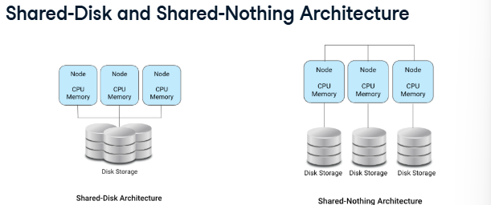
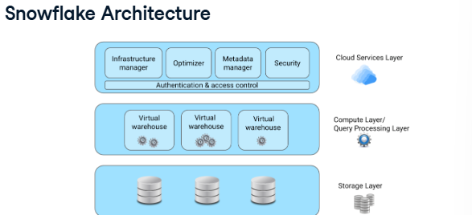
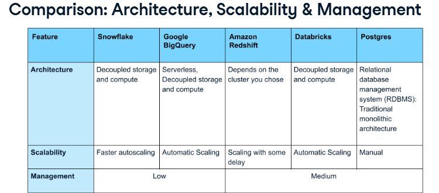
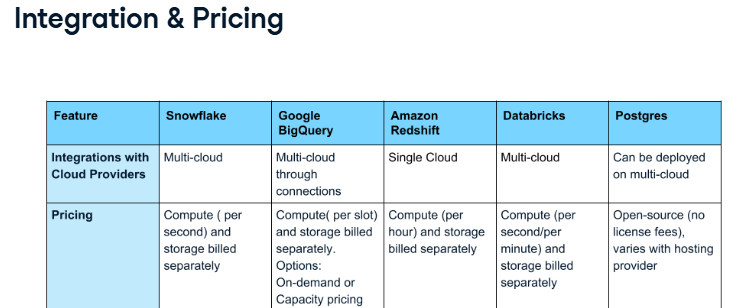

[_Previous (AssociateDE_StudyNotes1)_](AssociateDE_StudyNotes1.md) \
[_Previous (AssociateDE_StudyNotes2)_](AssociateDE_StudyNotes2.md) \
[_Previous (AssociateDE_StudyNotes3)_](AssociateDE_StudyNotes3.md) 

# Associate Data Engineering in SQL - PART IV

### Table of contents - PART IV

- [Introduction to Snowflakes](#introduction-to-snowflakes)
     - [Introduction to Snowflake: Architecture, Competitors, and SnowflakeSQL](#introduction-to-snowflake-architecture-competitors-and-snowflakesql)
     - [Snowflake SQL and key concepts](#snowflake-sql-and-key-concepts)
     - [Advance Snowflake SQL Concepts](#advance-snowflake-sql-concepts)
- [Understanding Data Visualization](#understanding-data-visualization)
     - [Project: Exploring London's Travel Network](#project-exploring-londons-travel-network)
- Tutorial: How to Install PostgreSQL

# Introduction to Snowflakes
## Introduction to Snowflake: Architecture, Competitors, and SnowflakeSQL
### What is snowflake
- what is snowflake? Snowflake is a  cloud-based data warehouse that utilizes a columnar data storage model. \
     Row database: Postgres, MySQL, Oracle, Microsoft SQL Server \
     Columnar database: Snowflake, Amazon Redshift, Google BigQuery, Vertica \
     It has a unique ability to connect with multiple cloud providers like AWS, GCP, or Azure.
- Snowflake use cases: Business Intelligence, Data Science, Data Ingestion, Data warehousing, Data Sharing.
- Snowflake SQL is quite similar to PostgreSQL. Even though Snowflake automatically capitalizes column names by default, fundamental commands like SELECT will operate in much the same way as they do in PostgreSQL. 
### Snowflake architecture
- storage and compute - how data is stored and processed. \
     - Two architectures: "Shared-Disk" architecture and "shared-nothing" architecture
          - 
          - "Shared-Disk" architecture: Traditionally, many databases follow a "Shared-Disk" architecture. In this, each node(a processor or computer) __has its own memory and CPU but shares the same storage__, allowing any node to read or write to any part of the shared storage.
          - "shared-nothing" architecture __separates storage and compute__. Here, every node has its own disk storage. This is a key concept called "Decoupling storage & compute"
               - This ensures data is __stored efficiently__ and __processed independently__, allowing each component to operate without relying on the other.
               - Snowflake adopts this decoupling.
               - benefit? __Enhanced scalability__. Snowflake can __store more data or process data faster independently__, leading to __quicker responses__ and more __cost-effective operations__.
          - Practice: help understand this decoupling.
               - In Snowflake's cutting-edge architecture, one of its defining features is the concept of decoupling compute and storage. This innovative approach allows organizations to gain significant advantages in scalability, performance, and cost optimization. What does decoupling compute and storage mean in Snowflake architecture? \
                  Separating the compute resources from the data storage allows to scale them independently.\
                  The concept of decoupling compute and storage in Snowflake's architecture aims to separate these resources to enable independent scaling, not combining them to optimize performance.             
- snowflake architecture: __??? Snowflake uses a hybrid architecture. While it has a shared storage layer centralizing all data, its computing is distinctively decoupled.__ \
      
     1. Storage layer (columnar storage format) \
       Internal optimizations and compression: Columnar storage automatically organizes and reduces the size of our data to make it easier to access and analyze. We do not need to manually perform these tasks.
       Snowflake's storage layer __consists of tables, schemas, and databases, providing structured organization for our data__. It makes it easier to manage and retrieve the information we need.
     2. Compute layer \
          - __The Compute Layer is where queries are processed and transformed into valuable insights.__ It's like Snowflake's engine room. \
          - Snowflake uses something called __"virtual warehouses"__ to accomplish this. __Virtual warehouses are temporary computing resources created when a user submits a query.__ it works like a team on different parts of the query and performs operations like scanning data, filtering, aggregation, and joining based on the query requirements. 
          - Virtual warehouses: \
            __Scalability__: can be scaled up or down as needed \
            __Performance__: Designed for peak performance, they deliver rapid query results. \
            __Cost-effectiveness__: We only pay for the virtual warehouses we use to save money on data warehousing costs. \
            __Different sizes: XS, S, M, L, XL__: Snowflake offers virtual warehouses in different sizes, and we pay for the size we select. 
     3. Cloud Services layer \
          - __Infrastructure management__: This layer ensures when we run a query, the right resources, compute, and storage are allocated efficiently to get quicker results.          
          - __Security, Authentication & access control__: It's also in charge of maintaining the security of our data and controlling data access. \
          - __Metadata manager, Query Optimization__: In essence, the Cloud Services Layer acts as a conductor, coordinating all aspects of Snowflake to deliver a fast, secure, and reliable user experience.
- 
### Snowflake Competitors and why use snowflake
- Comparisons: Architecture, Scalability & Management \
    \
- Comparisons: Security & Data support \
  All platforms provide access controls. They also offer encryption. That ensures data remains protected. However, each platform has different means to achieve the same. \
  They all have semi-structured data support. However, how they store it varies for each platform. Databricks also support unstructured data like text, images, and audio.
- Comparisons: Integration & Pricing \
    \
     - Integration: Snowflake and Databricks natively integrate with multiple cloud providers, including AWS and GCP. Through cloud connectors, Google BigQuery supports multi-cloud. Amazon Redshift is hosted in its own ecosystem. Postgres can be deployed on platforms like GCP, AWS.
     - Pricing: Most cloud providers offer compute and storage pricing separately. (slot is a virtual CPU used to execute resources) BigQuery, offers on-demand, based on data processed and Capacity pricing, billed per slot-hour, making it more flexible.
- What makes Snowflake unique?
     - Unique architecture - decoupling compute, storage: making it ideal for workloads that require a lot of data processing or need to scale up or down quickly.
     - Secure data sharing: Snowflake allows secure data sharing between organizations, departments or users, ensuring the data's confidentiality, integrity, and privacy.
     - High performance: It is designed to handle complex queries efficiently, making it highly performant. 
     - multi-cloud support.
     - Pricing: simple pay-as-you-go pricing.
- SnowflakeSQL and PostgreSQL are very similar.
- Practice:  Postgres is a on-premise data warehouse, it can be hosted on cloud platforms.\
     A major feature of Snowflake is decoupled Storage and Compute.\
     Postgres follows a monolithic architecture that __couples__ all functionalities together.
  
## Snowflake SQL and key concepts
### Connecting to snowflake and DDL commands
- we'll explore various methods of connecting to Snowflake and introduce basic Snowflake DDL commands.

- 
### Snowflake database structure and DML
### Snowflake data type and data type conversion
### Functions, sorting, and grouping

## Advance Snowflake SQL Concepts
### Joining in snowflake
### Subqueries
### Snowflake query optimization
### Handling semi-structured data
### Wrap-up

# Understanding Data Visualization
Doesn't cover Building data pipelines, or Analyzing warehouse data
## Project: Exploring London's Travel Network

# Tutorial: How to Install PostgreSQL
