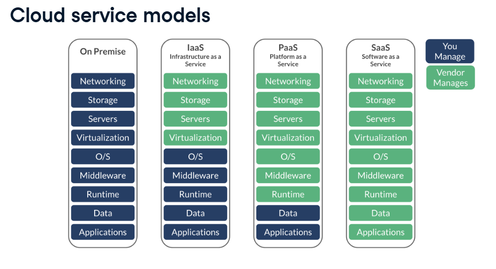
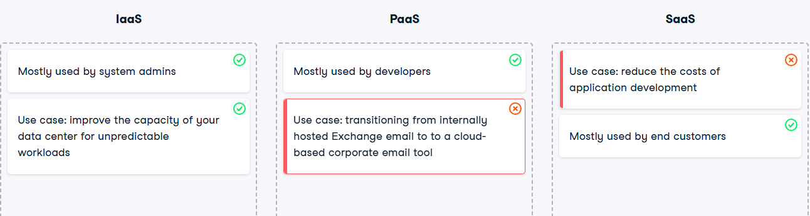
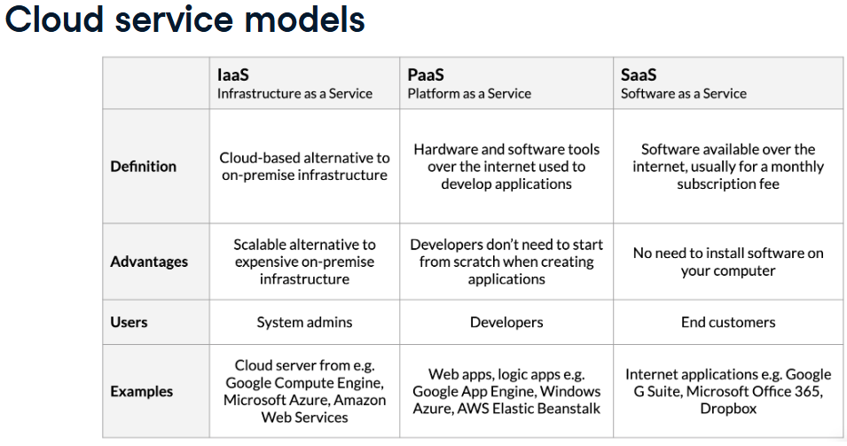
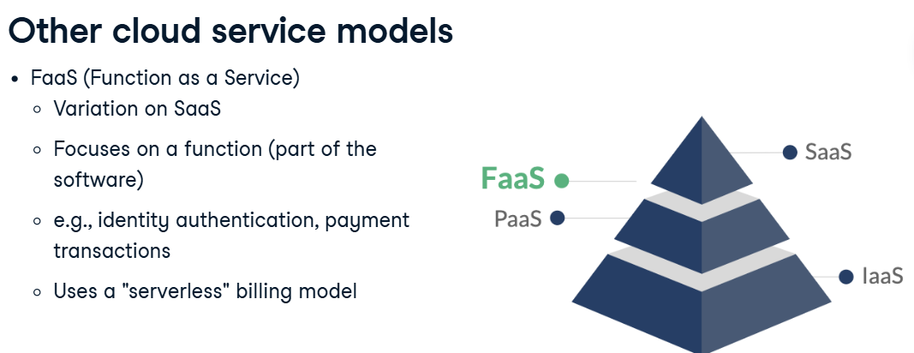

### Table of Contents
- [Understanding Cloud Computing](#understanding-cloud-computing)
- [Python](#python)

- [ETL and ELT in Python](#etl-and-elt-in-python)
    - [Introduction to Data Pipelines](#introduction-to-data-pipelines)
    - [Building ETL pipelines](#building-etl-pipelines)
    - [Advanced ETL techniques](#advanced-etl-techniques)
    - [Deploying and Maintaining a Data Pipeline](#deploying-and-maintaining-a-data-pipeline)

# Understanding Cloud Computing
Cloud service models:

In cloud computing terms, IaaS means you "rent" the fundamental building blocks: networking, storage, and servers. PaaS includes the underlying infrastructure plus tools and software needed to build applications, such as operating systems and middleware. SaaS provides software via a web browser or app, with the hardware and OS managed by the vendor.

Using a cloud email tool means that you will rent the software, ready to go, usually for a monthly subscription fee.

More abstraction means less detail but easier management. The highest level of abstraction covers the entire system, while lower levels involve fewer components

# Python
## Intro to Python for Developers

## Intermediate Python for Developers

# Importing Data in Python
## Intro to Importing Data in Python

## Intermediate Importing Data in Python

# Cleaning Data in Python

# Writing Efficient Python Code
# Streamlined Data Ingestion with pandas

# Git
## Intro to Git
## Intermediate Git

# Software Engineering Principles in Python

# Project: Performing a Code Review
# ETL and ELT in Python
## Introduction to Data Pipelines
### Introduction to ETL and ELT Pipelines

### Building ETL and ELT Pipelines

## Building ETL pipelines

## Advanced ETL techniques

## Deploying and Maintaining a Data Pipeline

# Introduction to Apache Airflow in Python

# Project: Building a Retail Data Pipeline
# Project: Cleaning Data in Python
