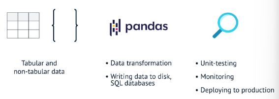

### Table of Contents
- [Understanding Cloud Computing](#understanding-cloud-computing)
- [Python](#python)

- [ETL and ELT in Python](#etl-and-elt-in-python)
    - [Introduction to Data Pipelines](#introduction-to-data-pipelines)
    - [Building ETL pipelines](#building-etl-pipelines)
    - [Advanced ETL techniques](#advanced-etl-techniques)
    - [Deploying and Maintaining a Data Pipeline](#deploying-and-maintaining-a-data-pipeline)


# Understanding Cloud Computing
Cloud service models:


In cloud computing terms, IaaS means you "rent" the fundamental building blocks: networking, storage, and servers. PaaS includes the underlying infrastructure plus tools and software needed to build applications, such as operating systems and middleware. SaaS provides software via a web browser or app, with the hardware and OS managed by the vendor.


Using a cloud email tool means that you will rent the software, ready to go, usually for a monthly subscription fee.


More abstraction means less detail but easier management. The highest level of abstraction covers the entire system, while lower levels involve fewer components

# Python
## Intro to Python for Developers

## Intermediate Python for Developers

# Importing Data in Python
## Intro to Importing Data in Python

## Intermediate Importing Data in Python

# Cleaning Data in Python

# Writing Efficient Python Code
# Streamlined Data Ingestion with pandas

# Git
## Intro to Git
## Intermediate Git

# Software Engineering Principles in Python

# Project: Performing a Code Review

# ETL and ELT in Python
## Introduction to Data Pipelines
### Introduction to ETL and ELT Pipelines
- Data pipelines are responsible for moving data from a source to a destination, and transforming it somewhere along the way.
- ETL pipelines use tools like Python and libraries such as pandas to manipulate and transform data. Data sources may be tabular or non-tabular. loading it to a destination.
- ELT pipelines - usually operating tabular data before loading it to a data warehouse for transformation.
- Build ETL pipelines:
  ```
  #python
  import pandas as pd
  #Use custom-build Python functions to extract, transform and load data
  def extract(file_name):
    print(f"Extracting data from {file_name}")
    return pd.read_csv(file_name)
  def transform(data_frame, value):
      return data_frame.loc[data_frame["name"]=value, ["name","num_firms"]] 
  def load(data_frame, target_table):
      #write a pandas DataFrame to a SQL database
      data_frame.to_sql(name=target_table, con=POSTGRES_CONNECTION)
      print(f"Loading data to the {target_table} table")

  # run/execute the ETL data pipeline
  extracted_data = extract(file_name="raw_data.csv")
  transformed_data = transform(data_frame=extracted_data)
  load(data_frame=transformed_data, target_table="cleaned_data")

  ```
- Build ELT pipelines
  ```
  #python
  ...    
  def transform(source_table, target_table):
      data_warehouse.run_sql("""
          CREATE TABLE {target_table AS
              SELECT
                  <field_name>, <field_name>, ...
              FROM {source_table};
      """)
   # run/execute the ELT data pipeline
   extracted_date = extract(file_name="raw_data.csv")
   load(data_frame=transformed_data, target_table="raw_data")
   transformed_data = transform(dsource_table="raw_data", target_table="cleaned_data")   
   ```
  - 
  
## Building ETL pipelines
### Extract data from structure sources
- 
- parqute and database
    ```
    
    ```
### Transforming data with pandas
### Monitoring a data pipeline
- logging data pipeline perfromance.

- Handling specific exceptions with try-except
- 

## Advanced ETL techniques
### Extracting non-tabular data
### Transforming non-tabular data
### Advanced data transformation with pandas
### Loading data to a SQL database with pandas

## Deploying and Maintaining a Data Pipeline


# Introduction to Apache Airflow in Python

# Project: Building a Retail Data Pipeline
# Project: Cleaning Data in Python
