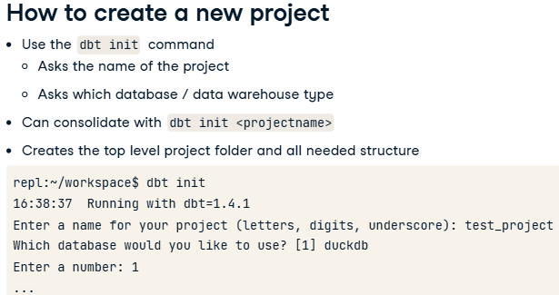
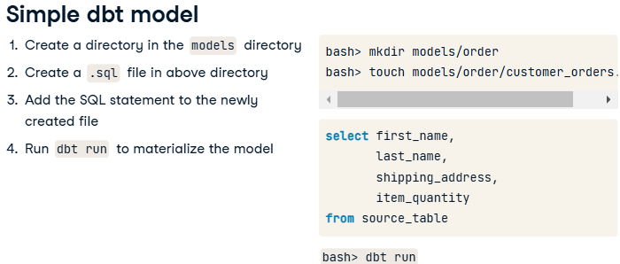
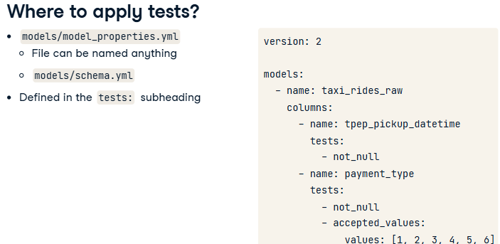
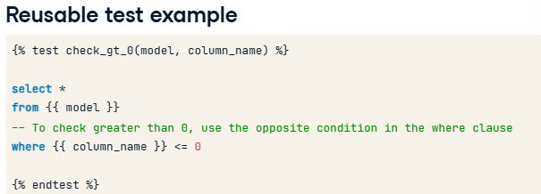
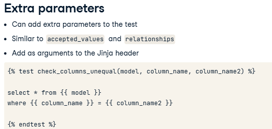
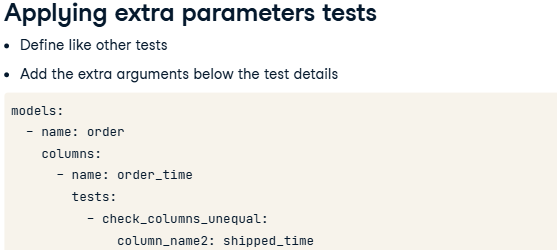
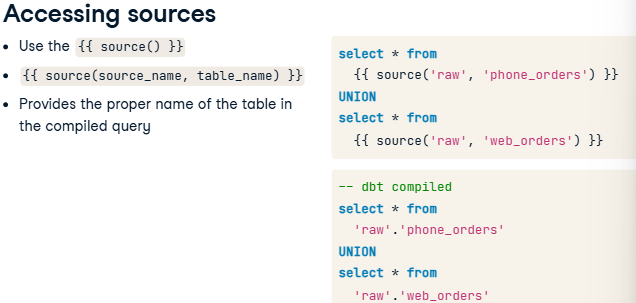
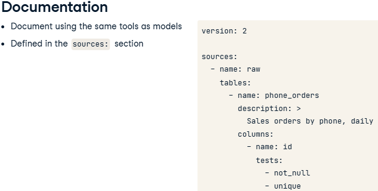
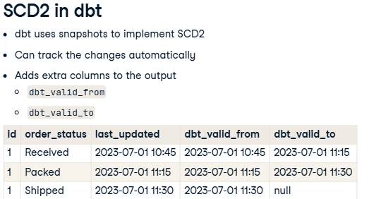
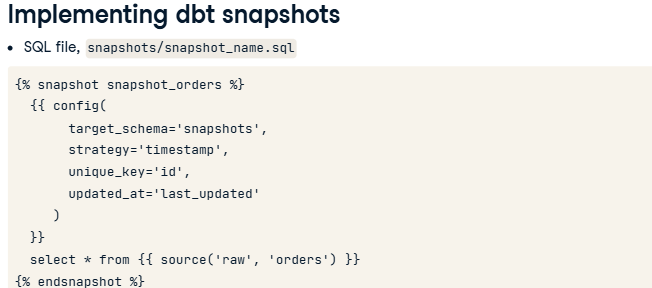

Professional Data Engineer in Python

Table of Content I

- [Understanding Modern Data Architecture](#understanding-modern-data-architecture)
- [Introduction to Shell](#introduction-to-shell)
- [Inroduction to dbt](#inroduction-to-dbt)
    - [Welcome to dbt](#welcome-to-dbt)
    - [dbt models](#dbt-models)
    - [Testing and Documentation](#testing-and-documentation)
    - [Implementing dbt in production](#implementing-dbt-in-production)

# Understanding Modern Data Architecture
# Introduction to Shell

# Inroduction to dbt
You'll learn to build data warehouses, perform data modeling and transformations, and design tests to perform data validation.  learn how to generate documentation for your warehouse users
## Welcome to dbt
### What is dbt?
- What is dbt?
    - dbt, also known as the __data build tool__, is designed to simplify the management of data warehouses and transform the data within. This is __primarily the T, or transformation__, within ELT (or sometimes ETL) processes. \
    - It __allows for easy transition between data warehouse__ types (such as Snowflake, BigQuery, Postgres, or DuckDB. dbt is ideal for teams, including those with analysts and engineers.
    - dbt also __(provides source/code control)__ provides the ability to define SQL and transformations in source-controlled environments (where typically this is difficult to accomplish.)
- What does dbt do?
    - dbt __primarily defines data models and the transformations of those models using SQL__. (Newer versions of dbt can also use Python)\
    Here, a data model represents the structure of your data and how its elements relate. 
    - dbt __translates between SQL dialects__ as appropriate to connect to different data sources and warehouses.
    - It can __define the relationships between data models__ and manage the dependencies that arise when using them.
    - dbt actually __runs the transformation process (or processes) when requested__.
    - Finally, dbt can also __test and verify the data matches user-defined quality requirements__. We'll cover all of these in later videos.
- What does dbt look like?
    - Command-line tool, also known as dbt-core.
    - Adapters provide connections to different data warehouses: dbt-snowflake, dbt-bigquery, and dbt-sqlserver.  some managed as part of the project, others that are managed by third-party volunteers or companies. 
    - There is also a managed version of dbt known as dbt Cloud. 
- dbt subcommands
    - `dbt`  or `dbt -h` : Show help content
    - `dbt <subcommand> -h` : Help for subcommand
    - `dbt init` :Creates new dbt projects
    - `dbt run` : Runs the data generation/transformations process (and pushes updates to the warehouse. It should be run whenever there are model changes, or when the data process needs to be materialized.)
    - `dbt test` :Run the data quality tests available within dbt projects.
    - `dbt debug` : Can check connections to data warehouses or database.
    - See more in `dbt -h` or dbt documentations
### Creating a dbt project
- What is a dbt project?
    - Projects __encompass all the needed (and optional) components for working with data within dbt__.
        - __Project configuration__ includes the project name, folder names, etc.
        - __Data sources and destinations__
        - __SQL queries and templates__ that define how to access and transform the data into the desired formats.
        - A dbt project can also include documentation for the data and the relationships within it.
    - It's important to note that a dbt project is __implemented as a folder structure__ on a given machine. As such, it can be easily copied, modified, or placed into source control as needed.
    - 
- How to create a new project? 
    - 
    - `dbt init` will then create the top-level project folder and subfolders and configuration files for the project. 
- Defining configuration with project profiles
    - understand about dbt projects is the idea of a profile.
    - Within dbt, __a profile is most analogous to a given deployment scenario__. This can include __development, staging or testing, and production__.
    - Each profile can be defined as the user sees fit. __Multiple profiles can exist within a given dbt project__, allowing for different warehouse configurations based on the deployment scenario.
    - These profiles (ie, configurations) are __defined in the profiles.yml (or profiles dot yaml) file__, which is not automatically created on a new project.
    - This is an example profiles.yml file with two deployment types (dev and prod), and the default, as set by the option target, is currently set to dev. 
    - DuckDB is useful for development and testing locally, while Snowflake would be better used in production as other users will likely need to access the data.
- YAML
    - YAML stands for __Yet Another Markup Language__.
    - It is __a text based file format, but whitespace indentation(spacing) matters__, much like Python.
    - YAML is __used in many development scenarios, often for configuration__, due to its relatively human-readable format.
    - The __rules for writing or modifying YAML can be tricky, but maintain indentation as illustrated in examples__. Be aware of the formatting requirements if you need to create one from scratch.
- DuckDB: is an __open-source serverless database, similar to sqlite__(This means there is not a server process required, in contrast to postgresql or mysql). It is __designed for analytics__, ie, data warehouses, and is __fast due to its vectorized nature__. __easy to use__, dbt-duckdb
- Practice
    - Project Name: nyc_yellow_taxi     Database type: duckdb
    - initializing a dbt project: bash: `dbt init nyc_yellow_taxi`   --> (top-level folder (nyc_yellow_taxi) and subfolders and configuration files are created: analyses, macros, snapshots, models, seeds, tests, README.md, dbt_project.yml)
    - Creating a project profile shown as below: nyc_yellow_taxi/profiles.yml. Then bash: `dbt debug`  (to verify there are no errors(->generated two files: .user.yml, dbt.duckdb))
      ```
      nyc_yellow_taxi:
          outputs:
              dev:
                  type: duckdb
                  path: dbt.duckdb
          target: dev
      ```
### Working with a first project
- Workflow for dbt (A workflow for dbt depends somewhat on the user's needs, but typically follows as belwo)
    1. __Create project (`dbt init`__ or copy a working project from another location)
    2. __Define or update its configuration (profiles.yml file)__. 
    3. __Create /use models/ templates__ (you'll spend most of your time developing with dbt - defining and using the data models. basic transform data)
    4. Once the models are defined, we need to __instantiate them using the `dbt run` subcommand__. (This command will take the source SQL code you've written, translate it as necessary for your deployment target (aka, profile), and actually execute the transformation process.)
    5. When complete, you'll need to __verify and test your data and, if necessary, troubleshoot any issues.__
    6. Finally, this process is __repeated as necessary__, typically going back to the model level when a new data source is required.

Please note that in this circumstance, __materialized__ has a specific meaning in dbt. It means to execute the transformations on the source data and place the results into tables or views in data warehouse. 
- table vs view
    - a table is __an object__ within a database or warehouse that actually holds data. These objects take up space within the database, relative to the size of data inserted into the database.
    - A view is usually defined as __a select query__ against another table or tables. As such, the content in the response is generated with each query.
- Practice 1: Running a project. You've successfully created a project and defined the required parameters to connect to your data warehouse. Your manager would like __the data to be materialized into the data warehouse__ from the initial data source, using some example configurations a colleague tested with previously. Note that your colleagues have provided a test script called datacheck to validate the contents of the data warehouse. 
    - nyc_yellow_taxi/models/taxi_rides/taxi_rides_raw.sql
      ```
      with source_data as (
          -- Add the query as described to generate the data model
          select * from read_parquet('yellow_tripdata_2023-01-partial.parquet')
      )

      select * from source_data
      ```
    - Use the command `dbt run` to materialize the data into the data warehouse, noting the error that appears.
    - In the terminal, run the command __`./datacheck`__ to verify there are 300000 total_rides and look at a sample of the content from the data warehouse. \
     ```
     --nyc_yellow_taxi/datacheck
     #!/usr/bin/env python3
     import duckdb
     con = duckdb.connect('dbt.duckdb', read_only=True)
     print(con.sql('select * from taxi_rides_raw limit 10'))
     print(con.sql('select count(*) as total_rides from taxi_rides_raw'))
     if (con.execute('select count(*) as total_rides from taxi_rides_raw').fetchall()[0][0] == 300000):
         with open('/home/repl/workspace/successful_data_check', 'w') as f:
             f.write('300000')
     ```
- Practice 2: Modifying a model. Your manager is pleased with the progress you've made thus far, but some requirements have changed. After speaking with the analytics team, they're concerned about __the response time of a model__. This model is currently configured to generate a view in the data warehouse, rather than a table. Currently the dbt configuration is set to create a view rather than generate a table for querying. Your manager asks that you update the appropriate configuration in the model and regenerate the transformations.
    - Open the models/taxi_rides/taxi_rides_raw.sql file and modify the appropriate configuration to generate a table. \
      DuckDB can read Parquet files directly "SELECT * FROM read_parquet('filename.parquet')" or "SELECT * FROM 'filename.parquet'"
      ```
      -- Modify the following line to change the materialization type
      -- {{ config(materialized='view')}}
      {{ config(materialized='table')}}

      with source_data as (
          select * from read_parquet('yellow_tripdata_2023-01-partial.parquet')
      )

      select * from source_data
      ```
    - Run the dbt subcommand to execute the project. Verify the command ran correctly and generated the correct type of database object.
      
## dbt models
### What is a dbt model?
- What is a data model?
    - conceptual, with different definitions depending on the context
    - Represents the logical meaning behind a set of data(whether a database table, Dataframe, data structure, or so forth. This could be a group of orders, customers, or something like the details of earthquakes in a given region.
    - Represents how a set of data and its various components relate to each other.
    - Helps users collaborate \
      You should recognize that there are always trade-offs made when defining a model, including complexity, amount of space required, etc.
- what is a model in dbt?
    - Represents something more specific than a basic data model - it __represents the various transformations__ performed on the raw source datasets.
    - These transformations are typically __written in SQL__, though newer versions of dbt can use Python for models / transformations.
    - __Each model__, or transformation, is usually a SELECT query, transforming the source data as desired. These queries are then __saved in a text file, with a .sql extension__. dbt will automatically use these files when tasked with various operations, such as dbt run.
- Simple dbt model/Creating a model in dbt \

    - Reading from parquet
    - Parquet: Columnar binary file format; Used by many tools(Apache Spark, Apache Arrow, DuckDB) to efficiently store data. It is becoming widespread for the purposes of __sharing and distributing datasets__.
- Practice: UPDATE and DELETE statements don't work with dbt. So they cannot be used as a dbt model
### Updating dbt models
- Why update?
    - An advantage of working with dbt is to easily make changes to your project or your team's project without requiring you to start from scratch.
    -  It could be an iterative task, where the requirements for your project have changed or have not been fully implemented yet.
    -  fixing bugs with queries/models
    -  Migrating data to different source or destination
- Update workflow- Directly updating .sql files for dbt models
    1. __check out a dbt project from your source control__ system, such as git. An example would be git clone dbt_project, then opening the dbt_project folder. You don't have to use git with dbt, but it is one of the advantages of doing, so as you can easily track changes / updates / modifications. 
    2.  Find the model file in question
    3.  update the query contents.
    4.  Regenerate with `dbt run` or `dbt run -f`  (Force full refresh)
    5.  check the changes back to source control
- YAML file: you may also need to make changes in some YAML / .yml files. Typically these updates would be in one of two types of files, either the __dbt_project.yml file or in a model_properties.yml file__.
    - dbt_project.yml
        - __contains settings that relate to the full project: the project name/ version, directory locations__.
        - __The materialization settings for a model__ can also reside here, though settings in this file are applied __globally__. These include defined whether models are created as tables / views / etc in the data warehouse.
        - Note that there is __one dbt_project.yml file per project__.
    - model_propertites.yml
        - __Specific to settings and details for model information__: description, documentation details, and much more (refer to the dbt documentation for more information.)
        - One interesting note is the file __can actually be named anything as long as it exists somewhere in the models/ subdirectory and ends in a .yml extension__.
        - You __can also have as many of these .yml files as needed__.
    - profiles.yml contains information about the various deployment details and represents the whole project.
### Hierachical models in dbt
- What is a hierarchy in dbt?
    - __Represents the dependencies between models__, meaning the relationship between source and transformed data. 
    - __Also known as a DAG(directed acyclic graph) or lineage graph__. Note that while a DAG is a common concept in data engineering tools, such as Spark, Airflow, and so forth, we're referring to a DAG specifically as implemented in dbt.
    - The primary purpose of a DAG or hierarchy is it __allows models to be built and updated according to dependencies__. This forces dbt to determine the order that models must be built and run accordingly. (It should be noted that without the lineage graph, the tables would be built in alphabetical order, which would fail).
- How are hierarchies defined in dbt?
    - We can __use the Jinja template language to define the model dependencies__. This is done within the model definition file, meaning the .sql file.
    - Most often __using the ref function__: To add the dependency, we __replace table name with `{{ ref('model_name') }}` in .sql file.__
    - Use __`dbt run`__ to materialize the models. (dbt will replace the ref templates with the actual table names in the generated SQL file)   
- Jinja templating language: is a simple text-based templating system used in many tools beyond just dbt, such as Django and Flask. Another way to consider the meaning of a template is simply one of substitution.
    - To define a Jinja template, simply put the desired content between two opening and closing curly braces within your text files. __`{{ ... }}` represents a template substitution__.
    - When dbt is run, it will replace the contents of the braces with the correct result.
    - The dbt tool has __many Jinja functions__ available for use in projects. This allows for more dynamic usage of dbt, such as with different source and destination data locations.
        - `ref`
        - `config` command:an easy way to access config settings,
        - `docs` command: allows access to various documentation content.
        - Many more
### Model troubleshooting
- Common model issues
    - Query errors: syntax errors (a misspelled keyword or column) or logic errors (the SQL isn't doing what you initially expected.)
        - Misspelling/ syntax issues(incorrectly ordering the query, or missing some necessary components)
        - Non-standard SQL (e.g. using TOP instead of LIMIT, custom functions. These queries may work with one dbt backend, but not with another. ) 
        - Common SQL logic issues: Not grouping by all non-aggregated columns; incorrect CTEs
    - invalid object references. This could be as simple as misspelling the table name, but it could also indicate trickier issues.
        - __With dbt's different backends, the tables and views that are created can be referenced in different ways__. The default method is to query the tables simply as named, but a different backend may use something different. For example, using Google's BigQuery looks for a context name first, while Databricks will often reference tables with a preceding underscore.
        - __A typical problem is trying to reference objects in your queries that have not yet been generated__. dbt does its best to order the object creations based on the order of use, but sometimes there are __circular references__ that keep this from happening.
- Troubleshooting methods
    -  __`dbt run`__ to try generating and creating the dbt objects. If there are errors in creating the models, you'll receive an error message and a suggestion of what to do, if available.
    -  The next area to investigate are __the dbt logs__. The generic logs can be found in the logs directory under dbt.log. There is also a log file for each job called `run_results.json`. This log file contains various information about the tasks and can point out errors found during the run.
    -  Another trick is __manually reviewing the SQL output of the generated model__. The problem may be apparent upon review, but you can also copy the generated code into a SQL editor (ideally with access to the data objects) and verify it works as you expect.
    -  Finally, make sure to __verify your fixes__ work and don't cause other issues before continuing.
## Testing and Documentation
### Introduction to testing in dbt
- What is a test? 
    - In dbt, __a test is an assertion or a validation of various dbt objects__. This can include __models__. It can also apply to __other dbt objects such as sources, seeds, and snapshots__.
    - Primarily, tests are used to verify our data is as expected. This can include tests for:
        - __null values__,
        - verifying __the values are in range__,
        - or the __relationships between data__.
        - We can also create __custom tests__ for validating specific logic. 
- Three Test types in dbt: built-in, singular, generic
    - Built-in tests(4 pre-defined tests):
        - unique: verify all values in a column are unique
        - not_null: verify all values in a column are not null
        - accepted_values: verify all values are within a specific list. These values are list in a values: option.  `values:[a, b, c, d]`
        - relationships: verify a connection of an object to a specific table/column, which takes a to: and field: option. `to: ref('table')`    `field: id`
- Where to apply tests? \
     \
    - Model tests are defined in a YAML file within the models directory - other tests, like seed tests are defined in their respective directories. We will name this file model_properties.yml. This file can technically be named anything .yml, such as schema.yml. The naming depends on your preferences or requirements. 
    - __The actual tests are defined under the tests subheading, under the column name option__ within the YAML.
- Running tests
    - `dbt test` This defaults to running tests for our entire project.
    - `dbt test --select modelname` : run it against a specific model
- Finding failures
    - First look at __the compiled SQL code__. This normally resides in the target/compiled/projectname/models/model_properties.yml directory.
    - __find the appropriate .sql file__ that matches the failed test or tests.
    - __Copy those contents into your database client and verify where issue exists__.
    - You can then __remove the data manually from source or modify your model scripts__ to handle the issue. rerun dbt run and dbt test to verify the issue is fixed.
### Creating singular tests
- What is singular test? \
  It is the simplest form of a __custom data test__ within dbt. It is __written as a SQL query__, which __must return the failing rows__. Singular tests are __defined as .sql files within the appropriate tests directory__ for the type of object being tested.
- Example singular test
    - We want to create a test to __verify that the order_total is greater than or equal to the subtotal__. 
    ```select * from order where order_total < subtotal```
    - By convention, we'll name this file `assert_order_total_gte_subtotal.sql` and place it in the tests directory.
    - Note that we could name this file whatever we wish, but it's helpful to be descriptive in the name. The test name will be referenced in any errors / logs of the project, so it helps in debugging to know exactly what failed.
- Singular test with Jinja: we can use Jinja in our tests
    - e.g. the ref function: this handles substituting the proper name of an object when it's compiled for our target data warehouse.  ```select * from {{ ref('order') }} where order_total < subtotal ```
    - it should be noted that dbt performs the substitutions when the test is run. As such, if your dbt profile changes, you need to run your project again before testing.
- Test debugging
    - When creating a new test, it's often best to __use a SQL editor to create the initial query and work through any typical SQL issues there__.
    - __Place the query into the appropriate file__,
    - making sure to __name the test uniquely__. If you don't, dbt can still use it but it will be difficult to determine which version of a test passes or fails in the output.
    - To speed development, you can __use the `dbt test --select testname` command to run only that specific test__. When you get a large dataset and have many tests, the amount of time required to run them all can increase greatly. The --select option should cut this down noticeably.
    - Finally, __check any errors in your test and update accordingly__.
### Creating custom reusable/generic tests
- What is a reusable test?
    - A reusable test, also called a generic test in dbt terminology, is __a test that can be reused in multiple situations.__
    - It's __much like a built-in dbt test, but can check on any condition__ you can query within SQL.
    - A generic test is built __using Jinja templating__ - we'll go over the details of that implementation in a moment.
    - The file is then __saved as a .sql file within the `tests/generic` subfolder__ in the dbt project.
    - It should be noted that to use a reusable test, __it must be defined for each model that uses it in the model_properties.yml file__, which is similar to how we use the built-in tests within dbt.
- Creating a reusable test
    -  For most any generic test, we will be substituting in two objects - model and column_name. The are treated as arguments to a Jinja function that becomes our test name.
    -  The first line of our test file must contain at least `` 
    -  Add actual SQL query, with `{{ object }}` substitutions (substitute in the model argument as a Jinja reference for the table, and the column_name argument as a reference for our validation check, usually in the where clause).
    -  End the file with the line ``.
    -  example: \
      
    check_gt_0 as function name, with model and column_name as parameters
- Applying resuable test to model (update `model_properties.yml` like when we did with the built-in tests)
- Extra parameters in test function and how to apply extra parameters tests
    - just add the extra parameters below the test details in `model_properties.yml` \
      \
     
### Creating and generating dbt documentation
- Why documents?
    - Sharing data details with other consumers
    - Centralize the sources of documentation
    - Providing details for updates/ changes/etc
    - Creating a repository for examples, suggestions for the use of the data, and details about SLAs (Service Level Agreements - how often the data is updated and any guarantees of accessibility of the data.)
- Generating documentation in dbt: dbt provides options to automatically add documentation to your project in various ways.
    - adding information to __model definitions__ (the overall model description, individual __column descriptions__).
    - can show the __data lineage or DAG (directed acyclic graph)__ - the flow of data from initial source tables and any transformation or aggregate tables we create.
    - We can also get any information about __tests and data validations__ that are applied to our models from the dbt documentation tools.
    - __View details of generated data warehouse: column data types and data sizes__.
- Generating documentation in dbt
    - `dbt docs` subcommand 
        - `dbt docs -h` subcommand: gives a description of the commands available for dbt docs
        - `dbt docs generate` subcommand: traverse the content of our project, __automatically creating the documentation website and formatting it into a static website__. \
    should be run after `dbt run`
- Accessing documentation
    - `dbt docs serve` subcommand. only be used locally or for development (as it is not designed with security)
    - Copy content to other hosting service for hosting the documentation: dbt cloud, Amazon's S3, any modern web server including Nginx, Apache, and so forth.
## Implementing dbt in production
### dbt sources: a different method to work with data in your data warehouse
- What is a data source?
    - __sources represent the ability to name and describe data__ loaded by the EL process, i.e. applying extra information to the data that is in / about to enter your data warehouse.
    - sources are helpful in defining data lineage, data testing, and data documentation.
    - __dbt sources are primarily present to provide data lineage__ information, which helps with validation, troubleshooting, and various aspects of data trust, such as how important is this data and where did it come from.
- Defining a source in yaml file\
    
- Accessing sources
    - Use Jinja `source` function to access a given source \
      ```select * from {{ source('raw', 'orders') }} ``` \
      Here, _raw_ is the database schema and _orders_ is the name of the table. \
      The function will return the proper name to access the source table depending on the data warehouse and its configuration.
    -     
- Testing sources
    - apply tests to sources: using the same methods (built-in, singular, and generic/reusable tests) that you apply to models. 
    - The tests are defined in the `sources:` section of the yml file, instead of the models: section. These are placed in the same yml file where the sources are defined.
- Documentation 
    - add documentation to your sources, using the same tools as with models.
    - As with tests, this is defined in the `sources:` section rather than the models: section of the appropriate yml file. In this example, we've defined our source and the tests, but add a description field for the table. \
        
### dbt seeds
- What are dbt seeds? dbt seeds are __CSV files__ that can be loaded into your data warehouse.
    - __Typically rarely changing sets of data__, e.g. list of countries, List of postal codes.
    - NOT meant for raw data or data exported from another process
- Why use dbt seeds?
    - CSV files are relatively __easy to manage__. You can edit this manually if needed, copy them as needed, and so on.
    - CSV files are __easy to use in various scenarios__, whether that's development, testing, or production options.
    - CSV files, as text, are __source controllable__. These can be easily added into git repositories, compared against previous versions, and so forth.
- How to define seeds in dbt?
    - __simply add a CSV file to the seeds subdirectory__ in your dbt project. 
    - __Make sure the header is the first row__ of the file. (e.g. a CSV file with a header shows three columns of zipcode, place, and state, followed by a short list of locations.)
    - __use the `dbt seed` command to load/import the data(data from this csv file) into the data warehouse__. 
- Further configuration
    - There are further configuration options available for seeds in dbt. These include __which schema and database__ to add the seed data. You can also define options, such as __whether to quote any, all, or specific columns__. More importantly, you can define __which datatypes to assign to given columns within the seed data__.
    - These changes __can be applied to a whole project(the dbt_project.yml file), or to individual seeds(seeds/properties.yml file) as needed__. (you can name the properties.yml file whatever you like as long as it's present in the seeds directory.)
- Defining a datatype on the columns (very common operation)
    - e.g. we're defining zipcode as a varchar of 5 characters instead of an integer. This is to preserve the leading zeros present in some US zip codes.
    ```
    version: 2

    seeds:
        - name: zipcodes
            config:
                column_types:
                    zipcode: varchar(5)
    ```
- Tests & documentation: same as models and sources
- Accessing seeds : {{ ref() }}  e.g select * from {{ ref('zipcodes') }}
```
#./datacheck file
#!/usr/bin/env python3
import duckdb
import os.path

try:
  con = duckdb.connect('dbt.duckdb', read_only=True)
  print(con.sql('select * from nynj_zipcodes'))
  if (con.execute('select count(*) as total_zipcodes from nynj_zipcodes').fetchall()[0][0] == 2877):
    print("Your data counts are correct!")
    with open('/home/repl/workspace/successful_data_check', 'w') as f:
      f.write('2877')
  else:
    print("There appears to be an issue with your data counts.")
except duckdb.CatalogException:
  if not os.path.isfile('/home/repl/workspace/nyc_yellow_taxi/seeds/nynj_zipcodes.csv'):
    print("It looks like the nynj_zipcodes.csv file is\n not present in the seeds/ directory.\n\nPlease move the file and try again.\n")
  else:
    print("It looks like your data warehouse doesn't exist yet\n\n Please run the dbt seed command and try again.\n")
```
### SCD2 with dbt snapshots
- What is a snapshot?
    - a snapshot is __a look into the changes of a dataset over time__. e.g. a fast-food order status, the state of production for a car, or the shipping status for a book purchased online.
- SCD2: slowly changing dimension type 2(a common component of a Kimball-style data warehouse). 
    - Primarily, SCD2 is a standard method to track changes over time(add new entities/rows for new updates). 
    - dbt can implement SCD2 using snapshots. \
     
      It can __automatically track our changes and add extra columns__ to our output. These columns are __dbt_valid_from and dbt_valid_to__, which track the datetimes of when the individual values for a row are valid. It is the most recent row if you see a null value in dbt_valid_to.
- Implementing dbt snapshots    
    1. Define a SQL file (e.g. snapshots/snapshot_name.sql) representing the data we want to snap. \
     
        - Start with __a Jinja `snapshot` command and the snapshot's name__.
        - __Ends with  directive__.
        - We __use a Jinja `config` function within the directives, taking several arguments__:
           - `target_schema` : This should be a separate schema from your default one, as snapshots can break existing tools due to the additional columns present.
           - `strategy` : is the strategy used. Usually, this is 'timestamp', meaning that dbt should check the timestamp to determine validity. There is another strategy, 'check_cols', it checks a set of columns to determine what changed since the last snapshot.
           - `unique_key` : a unique_key entry, the column's name representing the row, usually a primary key.
           - `updated_at` : the updated_at entry, which takes the column's name, showing the datatime of the change.
        - After closing the config entry, we need to add our __SQL command to query against__. This is __often a dbt source__, as a snapshot should be fairly early in the data process. Note that we could use `ref` as well to access a model if preferred. See more options for snapshots in dbt documentation.
    2. Create the snapshots
      - __Use the `dbt snapshot` subcommand to create snapshots__.
      - Then, we can __create or update a model to query against the snapshot_orders table using the `{{ ref() }}` Jinja command. e.g. select * from {{ ref('snapshot_orders') }}
      - __Run dbt snapshot often__ to see and maintain the potentially changed data, or we may miss the changes in the data, so it's best to __schedule the command to run automatically__.
### Automating with dbt build
- Review
    - `source`(data coming initially from extract and load processes) and `seeds`(support data like country lists, area codes, or postal codes) feed initial data to dbt
    - `models` handle the transformation of data tasks, typically of sources or seeds, for downstream users.
    - `snapshots` are used to track changes within datasets.
    - We can use `tests` to validate many of the components within dbt, including sources, seeds, models, and even snapshots. (Three types of tests: built-in, singular, and generic / reusable tests).
    - `dbt build` subcommand performs all these tasks, usually in a production environment.
- `dbt build` : combination of `dbt run`(run models), `dbt test` (run validations via tests), `dbt snapshot`(create any needed snapshots), and `dbt seed` (process any seeds). All tasks are created as a single job and performed together so that if there are any failures along the line, they can be handled as a whole instead of potentially causing issues within a production dataset. 
- Why?
    - `dbt build` is for the situation where __individual subcommands work well but may not handle all potential issues__, especially when run in a production environment.
        - __`dbt run` works but doesn't validate the data first, meaning that no tests are run__ prior to the model updates.
        - __`dbt snapshot` isn't run to maintain any potential changes__ (It isn't run prior to the model updates automatically, so any potentially tracked changes may not be caught.)
        - __`dbt seed` might not be complete for certain queries__ found in downstream models.
    - __`dbt build` will determine dependencies as a whole and run all tests prior to production changes__.
    - Note that __`dbt build` may be overkill in testing environments or if small changes are made__. In general, it's best to use `dbt build` if running against a production data warehouse, while the individual commands can be used in development or testing.
### Review and Next
 
http://docs.getdbt.com
