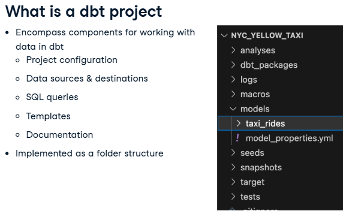

Professional Data Engineer in Python

Table of Content I
- [Inroduction to dbt](#inroduction-to-dbt)

# Understanding Modern Data Architecture
# Introduction to Shell

# Inroduction to dbt
You'll learn to build data warehouses, perform data modeling and transformations, and design tests to perform data validation.  learn how to generate documentation for your warehouse users
## Welcome to dbt
### What is dbt?
- What is dbt?
    - dbt, also known as the __data build tool__, is designed to simplify the management of data warehouses and transform the data within. This is __primarily the T, or transformation__, within ELT (or sometimes ETL) processes. \
    - It __allows for easy transition between data warehouse__ types (such as Snowflake, BigQuery, Postgres, or DuckDB. dbt is ideal for teams, including those with analysts and engineers.
    - dbt also __(provides source/code control)__ provides the ability to define SQL and transformations in source-controlled environments (where typically this is difficult to accomplish.)
- What does dbt do?
    - dbt __primarily defines data models and the transformations of those models using SQL__. (Newer versions of dbt can also use Python)\
    Here, a data model represents the structure of your data and how its elements relate. 
    - dbt __translates between SQL dialects__ as appropriate to connect to different data sources and warehouses.
    - It can __define the relationships between data models__ and manage the dependencies that arise when using them.
    - dbt actually __runs the transformation process (or processes) when requested__.
    - Finally, dbt can also __test and verify the data matches user-defined quality requirements__. We'll cover all of these in later videos.
- What does dbt look like?
    - Command-line tool, also known as dbt-core.
    - Adapters provide connections to different data warehouses: dbt-snowflake, dbt-bigquery, and dbt-sqlserver.  some managed as part of the project, others that are managed by third-party volunteers or companies. 
    - There is also a managed version of dbt known as dbt Cloud. 
- dbt subcommands
    - dbt  or dbt -h : Show help content
    - dbt <subcommand> -h : Help for subcommand
    - dbt init :Creates new dbt projects
    - dbt run : Runs the data generation/transformations process
    - dbt test :Run the data quality tests available within dbt projects.
    - dbt debug : Can check connections to data warehouses.
    - See more in dbt -h or dbt documentations
### Creating a dbt project
- What is a dbt project?
      -  
      - Projects __encompass all the needed (and optional) components for working with data within dbt__. \
          - __Project configuration__ includes the project name, folder names, etc.
  
  __Data sources and destinations__, such as where the source data comes from, as well as any destination data warehouses. dbt projects also include the SQL queries and templates that define how to access and transform the data into the desired formats. A dbt project can also include documentation for the data and the relationships within it. It's important to note that a dbt project is implemented as a folder structure on a given machine. As such, it can be easily copied, modified, or placed into source control as needed. We'll cover each of these further in this and later chapters.
- 
### Working with a first project

## dbt models
### What is a dbt model?
### Updating dbt models
### Hierachical models in dbt
### Model troubleshooting
## Testing & Documentation
### Introduction to testing in dbt
### Creating singular tests
### Creating custom reusable tests
### Creating ang generating dbt documentation
## Implementing dbt in production
### dbt sources
### dbt seeds
### SCD2 with dbt snapshots
### Automating with dbt build
### Course review
